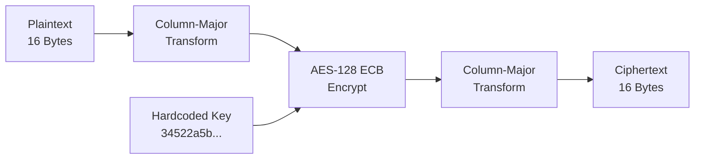

# LED Brille - Crypto-Analyse

## Ghidra-Analyse von libAES.so

### Setup

```bash
# Library aus APK extrahieren
unzip ledglasses.apk -d extracted/
cp extracted/lib/arm64-v8a/libAES.so .

# Ghidra starten
ghidraRun
# File → Import File → libAES.so
# Analyze → Auto Analyze
```

### Funktionen identifizieren

Nach der Auto-Analyse suchen wir nach relevanten Funktionen:

```
Symbol Tree → Filter: "encrypt"

Gefunden:
- Java_com_xl_ledglasses_AESCipher_encrypt
- AES_encrypt (aus OpenSSL/BoringSSL)
```

### JNI-Funktion analysieren

```c
// Decompiled: Java_com_xl_ledglasses_AESCipher_encrypt
void Java_com_xl_ledglasses_AESCipher_encrypt
    (JNIEnv *env, jclass cls, jbyteArray input) 
{
    // 1. Input-Array holen
    jbyte *inputBytes = (*env)->GetByteArrayElements(env, input, NULL);
    jsize length = (*env)->GetArrayLength(env, input);
    
    // 2. Column-Major Transformation VORHER
    byte transformed[16];
    columnMajorTransform(inputBytes, transformed);
    
    // 3. AES-Verschlüsselung mit hardcoded Key
    byte encrypted[16];
    AES_encrypt(transformed, encrypted, &aes_key);  // ← Key hier!
    
    // 4. Column-Major Transformation NACHHER
    byte result[16];
    columnMajorTransform(encrypted, result);
    
    // 5. Ergebnis zurückgeben
    jbyteArray output = (*env)->NewByteArray(env, 16);
    (*env)->SetByteArrayRegion(env, output, 0, 16, result);
    return output;
}
```

### Key-Extraktion

Der Key ist als globale Variable definiert:

```c
// Gefunden bei Adresse 0x00012340
unsigned char aes_key[16] = {
    0x34, 0x52, 0x2a, 0x5b, 
    0x7a, 0x6e, 0x49, 0x2c,
    0x08, 0x09, 0x0a, 0x9d, 
    0x8d, 0x2a, 0x23, 0xf8
};
```

**Extrahierter Key (hex)**: `34522a5b7a6e492c08090a9d8d2a23f8`

### Column-Major Transformation

Eine ungewöhnliche Transformation wird vor und nach AES angewendet:

```c
// columnMajorTransform - Rekonstruiert
void columnMajorTransform(byte *input, byte *output) {
    // Behandelt 16 Bytes als 4x4 Matrix
    // Konvertiert zwischen Row-Major und Column-Major
    
    for (int i = 0; i < 16; i++) {
        int row = i % 4;
        int col = i / 4;
        output[col + row * 4] = input[i];
    }
}
```

**Visualisierung**:

```
Input (Row-Major):        Output (Column-Major):
 0  1  2  3                0  4  8 12
 4  5  6  7       →        1  5  9 13
 8  9 10 11                2  6 10 14
12 13 14 15                3  7 11 15
```

### Verifikation

Test mit bekanntem Plaintext/Ciphertext aus Wireshark:

```python
from Crypto.Cipher import AES

KEY = bytes.fromhex("34522a5b7a6e492c08090a9d8d2a23f8")

def column_major_transform(data):
    """Convert between row-major and column-major"""
    result = bytearray(16)
    for i in range(16):
        row = i % 4
        col = i // 4
        result[col + row * 4] = data[i]
    return bytes(result)

def encrypt(plaintext):
    # 1. Column-Major Transform
    transformed = column_major_transform(plaintext)
    
    # 2. AES-ECB Encrypt
    cipher = AES.new(KEY, AES.MODE_ECB)
    encrypted = cipher.encrypt(transformed)
    
    # 3. Column-Major Transform (again)
    return column_major_transform(encrypted)

# Test mit ATATS Command
plaintext = bytes([7, 0x41, 0x54, 0x41, 0x54, 0x53, 1, 0, 5, 0, 0, 0, 0, 0, 0, 0])
ciphertext = encrypt(plaintext)

print(f"Calculated: {ciphertext.hex()}")
# Vergleich mit Wireshark-Capture...
```

**Ergebnis**: Berechneter Ciphertext stimmt mit Capture überein! ✓

## Kryptographische Schwächen

### 1. Hardcoded Key (CWE-798)

```
Problem:  Key ist in jeder App-Installation identisch
Impact:   Ein extrahierter Key kompromittiert ALLE Geräte
CVSS:     9.8 (Critical)
```

### 2. ECB Mode (CWE-327)

```
Problem:  ECB verschlüsselt gleiche Blöcke gleich
Impact:   Muster im Ciphertext erkennbar
CVSS:     4.7 (Medium)
```

**Demonstration**:

```python
# Gleicher Plaintext = Gleicher Ciphertext
plaintext1 = b"AAAAAAAAAAAAAAAA"  # 16x 'A'
plaintext2 = b"AAAAAAAAAAAAAAAA"  # 16x 'A'

cipher1 = encrypt(plaintext1)
cipher2 = encrypt(plaintext2)

assert cipher1 == cipher2  # ECB-Problem!
```

### 3. Keine Authentifizierung

```
Problem:  Kein HMAC, keine Signatur
Impact:   Beliebige Commands können gesendet werden
CVSS:     8.8 (High)
```

## Vollständiger Encryption Flow



## Python-Implementation

```python
from Crypto.Cipher import AES

class LEDGlassesEncryption:
    KEY = bytes.fromhex("34522a5b7a6e492c08090a9d8d2a23f8")
    
    @staticmethod
    def _transform(data):
        """Column-major transformation"""
        if len(data) != 16:
            raise ValueError("Data must be 16 bytes")
        result = bytearray(16)
        for i in range(16):
            row = i % 4
            col = i // 4
            result[col + row * 4] = data[i]
        return bytes(result)
    
    def encrypt(self, plaintext):
        """Encrypt with column-major + AES-ECB + column-major"""
        # Pad to 16 bytes
        padded = plaintext.ljust(16, b'\x00')[:16]
        
        # Transform → Encrypt → Transform
        transformed = self._transform(padded)
        cipher = AES.new(self.KEY, AES.MODE_ECB)
        encrypted = cipher.encrypt(transformed)
        return self._transform(encrypted)
    
    def decrypt(self, ciphertext):
        """Decrypt (reverse process)"""
        transformed = self._transform(ciphertext)
        cipher = AES.new(self.KEY, AES.MODE_ECB)
        decrypted = cipher.decrypt(transformed)
        return self._transform(decrypted)
```

## Zusammenfassung

| Aspekt | Details |
|--------|---------|
| **Algorithmus** | AES-128 ECB |
| **Key** | `34522a5b7a6e492c08090a9d8d2a23f8` |
| **Besonderheit** | Column-Major Transformation vor/nach AES |
| **Schwächen** | Hardcoded Key, ECB Mode, keine Auth |

---

:::tip Nächster Schritt
Weiter zum [Proof of Concept](./poc) um die Schwachstelle praktisch zu demonstrieren.
:::
