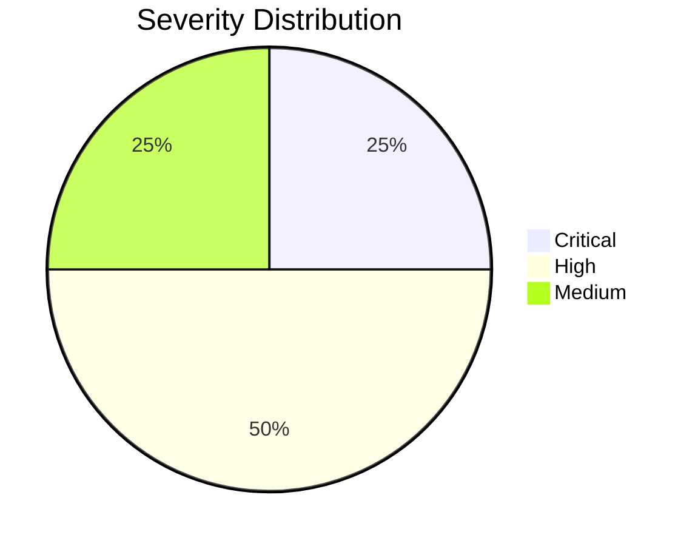

# LED Brille - Security Findings

## Übersicht

| Finding | CVSS | Severity | Status |
|---------|------|----------|--------|
| F-001 | 9.8 | Critical | Confirmed |
| F-002 | 4.7 | Medium | Confirmed |
| F-003 | 8.8 | High | Confirmed |
| F-004 | 7.5 | High | Confirmed |

## F-001: Hardcoded AES Encryption Key

### Beschreibung

Der AES-128 Verschlüsselungsschlüssel ist fest in der nativen Library `libAES.so` einprogrammiert und identisch für alle Geräte.

### Technische Details

```
Location: lib/arm64-v8a/libAES.so @ 0x00012340
Key (hex): 34522a5b7a6e492c08090a9d8d2a23f8
Algorithm: AES-128 ECB
```

### CVSS v3.1

```
Vector: CVSS:3.1/AV:A/AC:L/PR:N/UI:N/S:U/C:H/I:H/A:H
Score: 9.8 (Critical)

- Attack Vector: Adjacent (A) - BLE Reichweite
- Attack Complexity: Low (L) - Key einfach extrahierbar
- Privileges Required: None (N) - Kein Pairing nötig
- User Interaction: None (N) - Vollautomatisch
- Scope: Unchanged (U)
- Confidentiality: High (H) - Alle Commands lesbar
- Integrity: High (H) - Beliebige Commands sendbar
- Availability: High (A) - Gerät vollständig kontrollierbar
```

### Impact

- Angreifer kann alle BLE-Kommunikation entschlüsseln
- Beliebige Commands an das Gerät senden
- Ein extrahierter Key kompromittiert **alle Geräte weltweit**

### Proof of Concept

```python
from Crypto.Cipher import AES

KEY = bytes.fromhex("34522a5b7a6e492c08090a9d8d2a23f8")
cipher = AES.new(KEY, AES.MODE_ECB)

# Entschlüsseln von Wireshark-Capture
captured = bytes.fromhex("3e9d29cf48fb0ad27e1af5c3b1208d4f")
decrypted = cipher.decrypt(captured)
# → Original Command sichtbar!
```

### Remediation

| Priorität | Maßnahme |
|-----------|----------|
| Kritisch | Device-spezifische Keys aus Pairing ableiten |
| Hoch | Key Derivation Function (KDF) verwenden |
| Mittel | Secure Key Storage in Hardware (wenn verfügbar) |

---

## F-002: ECB Mode Usage

### Beschreibung

AES wird im ECB (Electronic Codebook) Modus verwendet, der bekannte Schwächen aufweist.

### Technische Details

```
Mode: AES-128 ECB
Block Size: 16 bytes
Problem: Gleiche Plaintexte → Gleiche Ciphertexte
```

### CVSS v3.1

```
Vector: CVSS:3.1/AV:A/AC:H/PR:N/UI:N/S:U/C:L/I:L/A:N
Score: 4.7 (Medium)
```

### Impact

- Muster in verschlüsselten Daten erkennbar
- Bei wiederholten Befehlen: Replay ohne Entschlüsselung möglich
- Schwächt die Gesamtverschlüsselung

### Demonstration

```python
# Gleicher Plaintext = Gleicher Ciphertext
enc1 = encrypt(b"MODE\x01\x00" + b"\x00" * 10)
enc2 = encrypt(b"MODE\x01\x00" + b"\x00" * 10)
assert enc1 == enc2  # ECB-Problem!
```

### Remediation

| Priorität | Maßnahme |
|-----------|----------|
| Hoch | CBC oder GCM Mode verwenden |
| Hoch | Zufälligen IV pro Nachricht |
| Mittel | Counter/Nonce für Replay-Schutz |

---

## F-003: No BLE-Level Authentication

### Beschreibung

Das Gerät erfordert kein BLE-Pairing und akzeptiert Verbindungen sowie Write-Operationen von jedem Gerät.

### Technische Details

```
Security Level Required: 1 (No Security)
Pairing Required: No
Bonding: Not Supported
MITM Protection: None
```

### CVSS v3.1

```
Vector: CVSS:3.1/AV:A/AC:L/PR:N/UI:N/S:U/C:H/I:H/A:L
Score: 8.8 (High)
```

### Impact

- Jedes BLE-fähige Gerät kann sich verbinden
- Keine Authentifizierung des Clients
- Ermöglicht unautorisierte Steuerung

### Test

```bash
# Verbindung ohne Pairing erfolgreich
gatttool -b XX:XX:XX -I --sec-level=low
> connect
Connection successful  # Keine Authentifizierung!
```

### Remediation

| Priorität | Maßnahme |
|-----------|----------|
| Kritisch | Security Level 2+ auf Characteristics |
| Hoch | Pairing mit Passkey erzwingen |
| Mittel | App-Level Authentication zusätzlich |

---

## F-004: Key Stored in Native Library

### Beschreibung

Der Verschlüsselungsschlüssel ist als Klartext in der nativen Library gespeichert und kann mit Standard-RE-Tools extrahiert werden.

### Technische Details

```
File: lib/arm64-v8a/libAES.so
Storage: Plaintext in .rodata section
Protection: None (no obfuscation)
Extraction: ~5 minutes with Ghidra
```

### CVSS v3.1

```
Vector: CVSS:3.1/AV:L/AC:L/PR:N/UI:N/S:U/C:H/I:H/A:N
Score: 7.5 (High)
```

### Impact

- Key kann von jedem mit der APK extrahiert werden
- Keine Reverse-Engineering-Hürde
- Kompromittiert alle Geräte

### Remediation

| Priorität | Maßnahme |
|-----------|----------|
| Hoch | Keys nicht in App speichern |
| Mittel | Code-Obfuscation (erschwert, verhindert nicht) |
| Niedrig | Integrity Checks der Library |

---

## Gesamtrisikobewertung



### Aggregiertes Risiko: **Critical**

Die Kombination aus hardcodiertem Key (F-001) und fehlender BLE-Authentifizierung (F-003) ermöglicht vollständige Geräteübernahme ohne jegliche Hürden.

## Empfohlene Maßnahmen

### Kurzfristig (Firmware-Update)

1. Security Level 2+ auf allen Characteristics erzwingen
2. Rate Limiting für Verbindungsversuche

### Mittelfristig (App-Update)

1. Per-Device Keys aus Pairing ableiten
2. Challenge-Response Authentication implementieren

### Langfristig (Neue Hardware)

1. Secure Element für Key Storage
2. LE Secure Connections (LESC) unterstützen

---

:::warning Disclosure Status
Diese Findings wurden dokumentiert für [Responsible Disclosure](/docs/tutorials/legal-framework#responsible-disclosure).
:::
