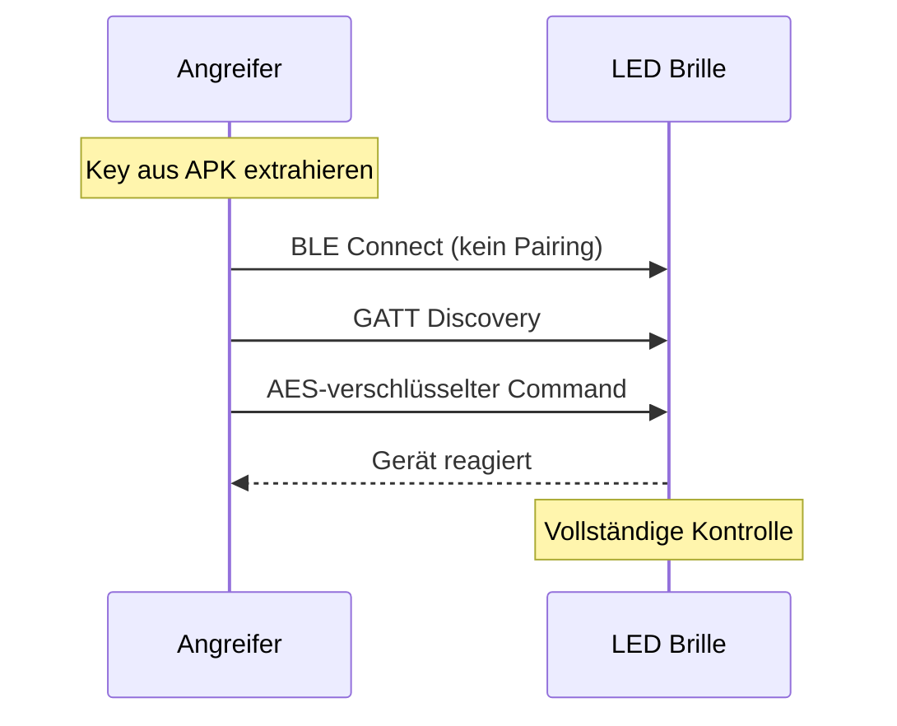

# LED Brille - Sicherheitsanalyse

## Geräteprofil

| Eigenschaft | Wert |
|-------------|------|
| **Gerätename** | GLASSES-12B008 |
| **Hersteller** | Unbekannt (China) |
| **Companion App** | "LED Glasses" (Android) |
| **BLE Service** | 0xFFF0 (Custom) |
| **Firmware** | Nicht extrahierbar |

## Executive Summary

Die LED Brille verwendet **AES-128 ECB Verschlüsselung** mit einem **fest einprogrammierten Schlüssel**, der aus der Android-App extrahiert werden konnte. Zusätzlich wird eine proprietäre **Column-Major Byte-Transformation** vor und nach der Verschlüsselung angewendet.

### Kritische Findings

| Finding | CVSS | Severity |
|---------|------|----------|
| F-001: Hardcoded AES Key | 9.8 | Critical |
| F-002: ECB Mode Usage | 4.7 | Medium |
| F-003: No BLE Authentication | 8.8 | High |
| F-004: Key in Native Library | 7.5 | High |

## Angriffsszenario

## Impact

Ein Angreifer innerhalb der BLE-Reichweite (~10m) kann:

- ✗ Beliebigen Text auf der Brille anzeigen
- ✗ Display-Modus ändern (scrolling, static, etc.)
- ✗ Gerät ohne Authentifizierung steuern
- ✗ Potenziell unangemessene Inhalte anzeigen

---

:::tip Navigation
Folge der detaillierten Analyse:
1. [Reconnaissance](./reconnaissance)
2. [App-Analyse](./app-analysis)
3. [Crypto-Analyse](./crypto-analysis)
4. [Proof of Concept](./poc)
5. [Findings](./findings)
:::
