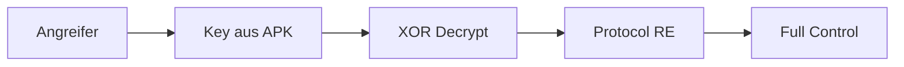

# LED Strips - Sicherheitsanalyse

## Geräteprofil

| Eigenschaft | Wert |
|-------------|------|
| **Gerätename** | LEDnetWF... |
| **Hersteller** | Diverse (China) |
| **Companion App** | "Magic Home" / "LED BLE" |
| **BLE Service** | 0xFFE0 (Custom) |
| **Protokoll** | Proprietary mit XOR |

## Executive Summary

Die LED Strips verwenden eine **XOR-basierte "Verschlüsselung"** mit einem **fest einprogrammierten 19-Byte Key** plus Counter. Die Verschlüsselung ist trivial zu brechen und bietet keinen echten Schutz.

### Kritische Findings

| Finding | CVSS | Severity |
|---------|------|----------|
| F-001: Hardcoded XOR Key | 9.8 | Critical |
| F-002: Trivial Encryption | 9.1 | Critical |
| F-003: No Authentication | 8.8 | High |
| F-004: Predictable Counter | 5.3 | Medium |

## Attack Vector

Ein Angreifer kann:
- ✗ LED-Farben beliebig ändern
- ✗ Ein/Aus-Schalten
- ✗ Effekte aktivieren
- ✗ Alle Geräte in Reichweite steuern
