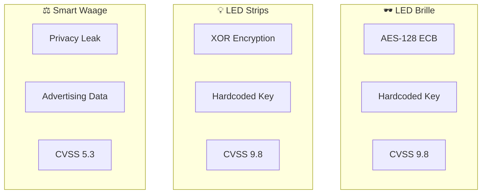

# Fallstudien

Diese Fallstudien dokumentieren reale Sicherheitsanalysen von BLE IoT-Geräten. Alle Analysen wurden an **eigenen Geräten** durchgeführt.

## Übersicht



## Zusammenfassung

| Gerät | Schwachstelle | CVSS | Impact |
|-------|---------------|------|--------|
| **LED Brille** | Hardcoded AES Key + Column-Major Transformation | 9.8 Critical | Vollständige Gerätesteuerung ohne App |
| **LED Strips** | XOR mit hardcodiertem Key | 9.8 Critical | Jedes Gerät in Reichweite steuerbar |
| **Smart Waage** | Gewicht im Advertising unverschlüsselt | 5.3 Medium | Privacy-Verletzung (10m Radius) |

## Gemeinsame Probleme

Alle analysierten Geräte teilen ähnliche Schwachstellen:

### 1. Keine BLE-Level-Authentifizierung

```
✗ Kein Pairing erforderlich
✗ Keine Security Level auf Characteristics
✗ Jeder kann sich verbinden und schreiben
```

### 2. Schwache oder keine Verschlüsselung

| Gerät | "Verschlüsselung" | Problem |
|-------|-------------------|---------|
| LED Brille | AES-128 ECB | Key hardcoded, ECB-Mode unsicher |
| LED Strips | XOR | Trivial zu brechen, Key hardcoded |
| Smart Waage | Keine | Klartext im Advertising |

### 3. Hardcoded Credentials

```java
// LED Brille - aus libAES.so extrahiert
unsigned char key[16] = {0x34, 0x52, 0x2a, 0x5b, ...};

// LED Strips - aus EncryptUtil.java
private static byte[] key = {89, 76, 90, 75, 53, 49, ...};
```

## Lessons Learned

### Für Entwickler

| Problem | Lösung |
|---------|--------|
| Hardcoded Keys | Device-spezifische Keys aus Pairing ableiten |
| Schwache Crypto | AES-GCM oder ChaCha20-Poly1305 verwenden |
| Keine Auth | BLE Security Level 3+ erzwingen |
| Privacy Leaks | Keine sensiblen Daten im Advertising |

### Für Sicherheitsforscher

1. **Immer die App dekompilieren** - Keys sind oft dort versteckt
2. **Native Libraries nicht vergessen** - Ghidra für .so-Dateien
3. **Advertising analysieren** - Privacy-Leaks sind häufig
4. **Wireshark-Capture früh machen** - Hilft beim Protokoll-Verständnis

## Detaillierte Analysen

Wähle eine Fallstudie für die vollständige Dokumentation:

| Fallstudie | Beschreibung |
|------------|--------------|
| [🕶️ LED Brille](./led-glasses/summary) | AES-128 mit proprietärer Column-Major Transformation |
| [💡 LED Strips](./led-strips/summary) | XOR-basiertes Protokoll mit Counter |
| [⚖️ Smart Waage](./smart-scale/summary) | Privacy-Leak durch Manufacturer Data |

---

:::tip Praxis
Die PoC-Scripts für alle Fallstudien findest du im [Downloads-Bereich](/docs/downloads/scripts).
:::
