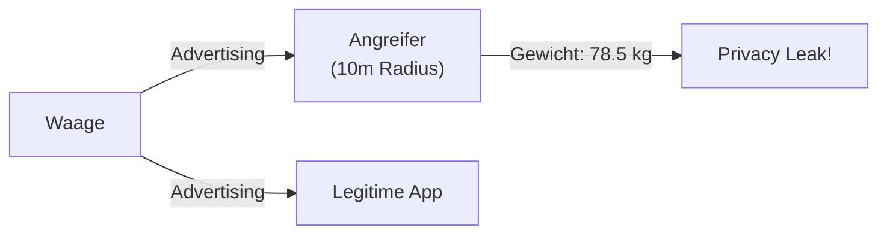

# Smart Waage - Sicherheitsanalyse

## Geräteprofil

| Eigenschaft | Wert |
|-------------|------|
| **Gerätename** | Yoda1 / QN-Scale |
| **Hersteller** | Diverse (China) |
| **Companion App** | "Yolanda Health" |
| **BLE Service** | 0xFFE0 |
| **Manufacturer ID** | 0x05C0 |

## Executive Summary

Die Smart Waage sendet **Gewichtsdaten unverschlüsselt** in den BLE Advertising-Paketen. Jeder mit einem BLE-Scanner in Reichweite (~10m) kann das Gewicht in Echtzeit mitlesen.

### Finding

| Finding | CVSS | Severity |
|---------|------|----------|
| F-001: Weight in Advertising | 5.3 | Medium |

## Privacy Impact

Ein Angreifer kann:
- ✗ Gewicht in Echtzeit mitlesen
- ✗ Gewichtsverlauf über Zeit tracken
- ✗ Person identifizieren (via MAC)
- ✗ Ohne Verbindung, rein passiv!
