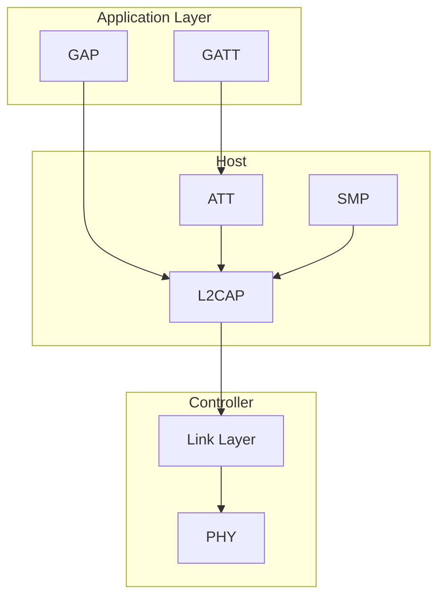
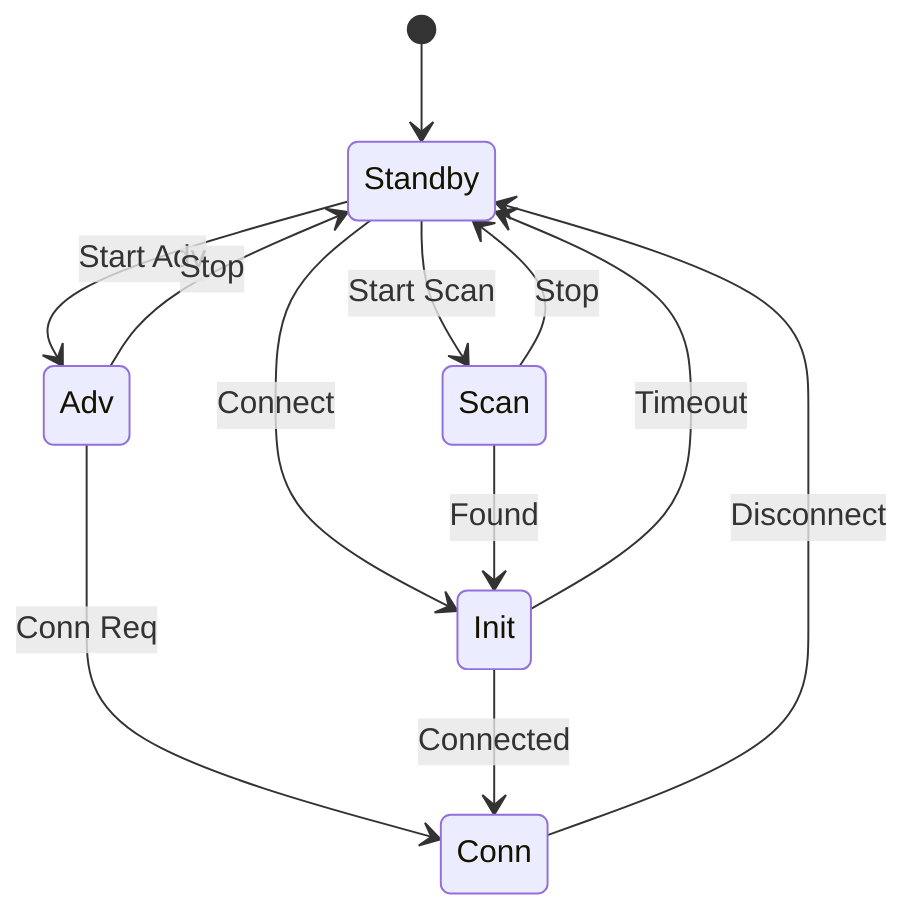
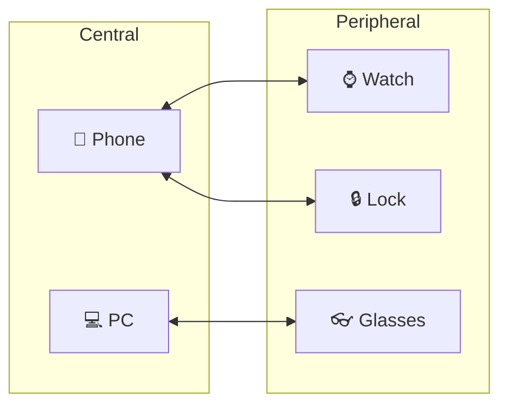

# BLE Grundlagen

Bluetooth Low Energy (BLE) ist ein drahtloses Kommunikationsprotokoll für energieeffiziente IoT-Geräte. Dieses Kapitel erklärt die fundamentalen Konzepte.

## BLE vs. Bluetooth Classic

| Eigenschaft | Bluetooth Classic | BLE |
|-------------|------------------|-----|
| Einführung | 1999 (v1.0) | 2010 (v4.0) |
| Reichweite | ~100m | ~100m |
| Datenrate | 1-3 Mbps | 125 kbps - 2 Mbps |
| Latenz | 100+ ms | 6 ms |
| Stromverbrauch | Hoch | Ultra-niedrig |
| Anwendung | Audio, Dateien | Sensoren, IoT |

## BLE-Stack



### Schichten im Detail

| Schicht | Abkürzung | Funktion |
|---------|-----------|----------|
| **Physical Layer** | PHY | 2.4 GHz ISM-Band, GFSK-Modulation, 40 Kanäle (37 Daten + 3 Advertising) |
| **Link Layer** | LL | Advertising, Scanning, Connection Management, Encryption auf Paketebene |
| **L2CAP** | L2CAP | Logical Link Control and Adaptation Protocol - Multiplexing, Fragmentierung |
| **ATT** | ATT | Attribute Protocol - Client-Server Modell für Datenattribute |
| **GATT** | GATT | Generic Attribute Profile - Strukturierung von Services und Characteristics |
| **GAP** | GAP | Generic Access Profile - Geräteerkennung, Verbindungsaufbau, Rollen |
| **SMP** | SMP | Security Manager Protocol - Pairing, Bonding, Key Distribution |

### Detaillierte Schicht-Beschreibungen

#### Physical Layer (PHY)

Der Physical Layer ist die unterste Schicht und definiert die Funkübertragung:

- **Frequenzband**: 2.400 - 2.4835 GHz (ISM-Band, lizenzfrei)
- **Modulation**: GFSK (Gaussian Frequency Shift Keying)
- **Kanäle**: 40 Kanäle à 2 MHz Bandbreite
  - Kanal 37 (2402 MHz): Advertising
  - Kanal 38 (2426 MHz): Advertising  
  - Kanal 39 (2480 MHz): Advertising
  - Kanäle 0-36: Datenkanäle
- **Datenraten** (BLE 5.0+):
  - 1 Mbps (LE 1M PHY) - Standard
  - 2 Mbps (LE 2M PHY) - Schneller
  - 125/500 kbps (LE Coded PHY) - Längere Reichweite

#### Link Layer (LL)

Der Link Layer verwaltet die Funkverbindung:

- **Advertising**: Periodisches Senden von Advertising-Paketen
- **Scanning**: Empfangen und Filtern von Advertising-Paketen
- **Initiating**: Verbindungsaufbau zu einem Advertiser
- **Connection**: Bidirektionale Kommunikation
- **Frequency Hopping**: Kanalwechsel nach jedem Connection Event
- **Whitening**: Bitfolgen-Scrambling zur Reduktion von DC-Bias

#### L2CAP (Logical Link Control and Adaptation Protocol)

L2CAP bietet:

- **Protokoll-Multiplexing**: Mehrere Protokolle über eine Verbindung
- **Fragmentierung**: Große SDUs in kleine PDUs aufteilen
- **Flow Control**: Credit-basierte Flusskontrolle (LE Credit Based Flow Control)

Feste Kanäle in BLE:
- CID 0x0004: ATT
- CID 0x0005: LE Signaling
- CID 0x0006: SMP

## BLE-Zustandsmaschine



### Zustandsbeschreibungen

| Zustand | Beschreibung | Typische Rolle |
|---------|--------------|----------------|
| **Standby** | Keine Funkaktivität, minimaler Stromverbrauch | Alle |
| **Advertising** | Sendet periodisch Advertising-Pakete auf Kanälen 37, 38, 39 | Peripheral |
| **Scanning** | Empfängt Advertising-Pakete, kann Scan Requests senden | Central |
| **Initiating** | Wartet auf Advertising eines bestimmten Geräts, sendet Connect Request | Central |
| **Connection** | Aktive bidirektionale Datenverbindung | Beide |

## Rollen in BLE



### Rollenverteilung

| Rolle | GAP-Rolle | Funktion | Ressourcen | Beispiele |
|-------|-----------|----------|------------|-----------|
| **Central** | Initiator | Initiiert Verbindung, steuert Timing | Mehr RAM/CPU | Smartphone, Computer, Hub |
| **Peripheral** | Advertiser | Advertised, stellt Daten bereit | Weniger Ressourcen | Sensoren, Wearables, Beacons |
| **Broadcaster** | - | Nur Advertising, keine Verbindung | Minimal | iBeacon, Eddystone |
| **Observer** | - | Nur Scanning, keine Verbindung | Variabel | Presence Detection |

### Mehrfache Verbindungen

Ein **Central** kann mit mehreren Peripherals gleichzeitig verbunden sein:

```
Central (Smartphone)
├── Peripheral 1 (Smartwatch)
├── Peripheral 2 (Fitness Tracker)
├── Peripheral 3 (Heart Rate Monitor)
└── Peripheral 4 (Smart Lock)
```

Ab BLE 5.0 kann ein Gerät auch **gleichzeitig** Central und Peripheral sein.

## Advertising

Peripherals senden **Advertising-Pakete** auf den drei Advertising-Kanälen:

```mermaid
sequenceDiagram
    participant P as Peripheral
    participant C as Central
    
    rect rgb(50, 50, 80)
        Note over P: Advertising Interval
        P->>C: ADV_IND (Ch 37)
        P->>C: ADV_IND (Ch 38)
        P->>C: ADV_IND (Ch 39)
    end
    
    C->>P: SCAN_REQ
    P->>C: SCAN_RSP
    
    C->>P: CONNECT_IND
    Note over P,C: Connection
```



### Advertising-Typen

| PDU Type | Connectable | Scannable | Directed | Use Case |
|----------|-------------|-----------|----------|----------|
| **ADV_IND** | ✓ | ✓ | ✗ | Standard, für alle sichtbar |
| **ADV_DIRECT_IND** | ✓ | ✗ | ✓ | Schnelle Reconnection zu bekanntem Gerät |
| **ADV_NONCONN_IND** | ✗ | ✗ | ✗ | Beacons, Broadcast-only |
| **ADV_SCAN_IND** | ✗ | ✓ | ✗ | Broadcast mit zusätzlichen Daten |
| **ADV_EXT_IND** | ✓/✗ | ✓/✗ | ✓/✗ | BLE 5.0 Extended Advertising |

### Advertising-Intervall

Das Advertising-Intervall bestimmt, wie oft ein Gerät advertised:

| Intervall | Stromverbrauch | Entdeckungszeit | Use Case |
|-----------|---------------|-----------------|----------|
| 20 ms | Sehr hoch | ~60 ms | Schnelle Erkennung |
| 100 ms | Hoch | ~300 ms | Balance |
| 1000 ms | Niedrig | ~3 s | Batterie-kritisch |
| 10240 ms | Minimal | ~30 s | Langzeit-Beacons |

### Advertising-Daten

Ein Advertising-Paket enthält bis zu **31 Bytes** Nutzlast (BLE 4.x) oder **255 Bytes** (BLE 5.0 Extended):

```
Advertising Data Structure:
┌─────────┬─────────┬──────────────┐
│ Length  │  Type   │    Data      │
│ (1 byte)│(1 byte) │ (Length-1)   │
└─────────┴─────────┴──────────────┘
```

Häufige AD Types:

| Type | Name | Beschreibung |
|------|------|--------------|
| 0x01 | Flags | Advertising-Flags (LE General Discoverable, etc.) |
| 0x02 | Incomplete 16-bit UUIDs | Teilweise Service-UUIDs |
| 0x03 | Complete 16-bit UUIDs | Alle 16-bit Service-UUIDs |
| 0x07 | Complete 128-bit UUIDs | Alle 128-bit Service-UUIDs |
| 0x08 | Shortened Local Name | Gekürzter Gerätename |
| 0x09 | Complete Local Name | Vollständiger Gerätename |
| 0x0A | TX Power Level | Sendeleistung in dBm |
| 0xFF | Manufacturer Data | Herstellerspezifische Daten |

## Connection-Parameter

Nach Verbindungsaufbau werden Parameter ausgehandelt:

| Parameter | Bereich | Default | Beschreibung |
|-----------|---------|---------|--------------|
| **Connection Interval** | 7.5 ms - 4 s | ~50 ms | Zeit zwischen Connection Events |
| **Slave Latency** | 0 - 499 | 0 | Anzahl übersprungener Events |
| **Supervision Timeout** | 100 ms - 32 s | 2 s | Timeout für Verbindungsverlust |

### Berechnung der effektiven Latenz

```
Effektive Timeout = Supervision Timeout
Effektive Latenz = Connection Interval × (1 + Slave Latency)

Beispiel:
- Connection Interval: 50 ms
- Slave Latency: 4
- Effektive Latenz: 50 ms × 5 = 250 ms
```

### Connection Event

```mermaid
sequenceDiagram
    participant C as Central
    participant P as Peripheral
    
    rect rgb(50, 80, 50)
        Note over C,P: Connection Event
        C->>P: Data/Empty PDU
        P->>C: Data/Empty PDU
        C->>P: Data (optional)
        P->>C: Data (optional)
    end
    
    Note over C,P: Connection Interval
    
    rect rgb(50, 80, 50)
        Note over C,P: Next Event
        C->>P: Data/Empty PDU
        P->>C: Data/Empty PDU
    end
```



## Frequenzen und Kanäle

BLE nutzt 40 Kanäle im 2.4 GHz ISM-Band:

### Kanalübersicht

| Kanal | Frequenz | Typ | Verwendung |
|-------|----------|-----|------------|
| 37 | 2402 MHz | Advertising | Primär Advertising |
| 0 | 2404 MHz | Daten | Connection |
| 1 | 2406 MHz | Daten | Connection |
| ... | ... | Daten | Connection |
| 10 | 2424 MHz | Daten | Connection |
| 38 | 2426 MHz | Advertising | Primär Advertising |
| 11 | 2428 MHz | Daten | Connection |
| ... | ... | Daten | Connection |
| 36 | 2478 MHz | Daten | Connection |
| 39 | 2480 MHz | Advertising | Primär Advertising |

### Frequency Hopping

BLE verwendet **Adaptive Frequency Hopping (AFH)**:

1. Datenkanäle wechseln nach jedem Connection Event
2. Schlechte Kanäle werden aus der Channel Map entfernt
3. Reduziert Interferenzen mit WLAN und anderen 2.4 GHz Geräten

```
Hop Sequence (vereinfacht):
Event 1: Kanal 5
Event 2: Kanal 23
Event 3: Kanal 11
Event 4: Kanal 31
...
```

## Security-Relevante Eigenschaften

### Was BLE NICHT automatisch macht

:::danger Wichtig
BLE ist **nicht standardmäßig sicher**!
:::

| Eigenschaft | Standard-Zustand | Konsequenz |
|-------------|------------------|------------|
| Verschlüsselung | **Aus** | Daten im Klartext lesbar |
| Authentifizierung | **Aus** | Jeder kann sich verbinden |
| Integritätsschutz | **Aus** (ohne Verschlüsselung) | Daten manipulierbar |
| Privacy | **Begrenzt** | MAC-Tracking möglich |
| Authorization | **Keine** | Alle Characteristics offen |

### Häufige Entwicklerfehler

| Fehler | Beschreibung | Konsequenz |
|--------|--------------|------------|
| **Just Works Pairing** | Keine zusätzliche Authentifizierung | MITM-Angriffe möglich |
| **Keine Zugriffskontrollen** | Characteristics ohne Security Level | Jeder kann lesen/schreiben |
| **Sensible Daten im Advertising** | Gewicht, ID, etc. öffentlich | Privacy-Verletzung |
| **Hardcoded Keys** | Schlüssel in App/Firmware | Einfache Extraktion |
| **Schwache Verschlüsselung** | XOR, Base64, ROT13 | Trivial zu brechen |
| **Kein Replay-Schutz** | Keine Nonces/Counter | Replay-Angriffe möglich |

### Security Mode 1 (Encryption-basiert)

| Level | Name | Beschreibung |
|-------|------|--------------|
| 1 | No Security | Keine Sicherheit |
| 2 | Unauthenticated | Just Works Pairing |
| 3 | Authenticated | Passkey/OOB Pairing |
| 4 | LE Secure Connections | ECDH + Authenticated |

---

:::tip Weiterführend
- [GATT-Architektur](./gatt-architecture) - Datenorganisation verstehen
- [Security Modes](./security-modes) - Sicherheitsmechanismen im Detail
- [Pairing Mechanisms](./pairing-mechanisms) - Pairing-Verfahren
:::
