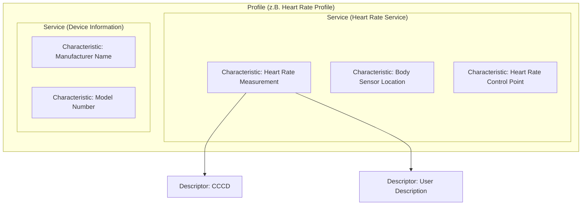

# GATT-Architektur

Das **Generic Attribute Profile (GATT)** definiert, wie BLE-Geräte Daten organisieren und austauschen.

## Hierarchie



### Ebenen

| Ebene | Beschreibung | Beispiel |
|-------|--------------|----------|
| **Profile** | Sammlung von Services | Heart Rate Profile |
| **Service** | Gruppiert zusammengehörige Daten | Heart Rate Service (0x180D) |
| **Characteristic** | Einzelner Datenwert | Heart Rate Measurement (0x2A37) |
| **Descriptor** | Metadaten zur Characteristic | CCCD (0x2902) |

## Services

Ein Service gruppiert logisch zusammengehörige Characteristics.

### Service-Struktur

```
Service Declaration (Handle 0x000A)
├── UUID: 0x180D (Heart Rate)
├── Type: Primary
└── Handles: 0x000A - 0x0015
```

### Service-Typen

| Typ | Beschreibung |
|-----|--------------|
| **Primary Service** | Hauptfunktionalität des Geräts |
| **Secondary Service** | Hilfsfunktion, referenziert von Primary |
| **Included Service** | Wiederverwendung eines anderen Services |

### Standard vs. Custom Services

```
# Standard (Bluetooth SIG)
0x1800 - Generic Access
0x1801 - Generic Attribute
0x180F - Battery Service
0x180A - Device Information
0x180D - Heart Rate

# Custom (128-bit UUID)
0000fff0-0000-1000-8000-00805f9b34fb
d44bc439-abfd-45a2-b575-925416129600
```

## Characteristics

Eine Characteristic ist der **grundlegende Datencontainer** in GATT.

### Characteristic-Struktur

```
Characteristic Declaration (Handle 0x000B)
├── Properties: READ | WRITE | NOTIFY
├── Value Handle: 0x000C
└── UUID: 0x2A37

Characteristic Value (Handle 0x000C)
└── Data: [actual value bytes]

Descriptor (Handle 0x000D)
├── UUID: 0x2902 (CCCD)
└── Value: 0x0001 (Notifications enabled)
```

### Properties (Bitfeld)

| Bit | Property | Hex | Beschreibung |
|-----|----------|-----|--------------|
| 0 | Broadcast | 0x01 | In Advertising einschließbar |
| 1 | Read | 0x02 | Lesbar |
| 2 | Write Without Response | 0x04 | Schreiben ohne Bestätigung |
| 3 | Write | 0x08 | Schreiben mit Bestätigung |
| 4 | Notify | 0x10 | Server kann benachrichtigen |
| 5 | Indicate | 0x20 | Server kann indizieren (mit ACK) |
| 6 | Authenticated Signed Writes | 0x40 | Signierte Writes |
| 7 | Extended Properties | 0x80 | Weitere Properties in Descriptor |

### Beispiel: LED Brille Characteristics

```python
# Aus JADX-Analyse extrahiert
CHARACTERISTICS = {
    "d44bc439-abfd-45a2-b575-925416129600": {
        "name": "Command/Control",
        "properties": ["WRITE", "WRITE_NO_RESP"],
        "handle": 0x0012,
        "purpose": "LED-Befehle senden",
    },
    "d44bc439-abfd-45a2-b575-92541612960a": {
        "name": "Data",
        "properties": ["WRITE", "WRITE_NO_RESP"],
        "handle": 0x0015,
        "purpose": "Textdaten übertragen",
    },
    "d44bc439-abfd-45a2-b575-925416129601": {
        "name": "Notification",
        "properties": ["NOTIFY"],
        "handle": 0x001b,
        "purpose": "Statusmeldungen empfangen",
    },
}
```

## Descriptors

Descriptors liefern **Metadaten** über eine Characteristic.

### Wichtige Descriptor-Typen

| UUID | Name | Beschreibung |
|------|------|--------------|
| **0x2900** | Characteristic Extended Properties | Zusätzliche Properties |
| **0x2901** | Characteristic User Description | Menschenlesbare Beschreibung |
| **0x2902** | Client Characteristic Configuration (CCCD) | Notifications/Indications aktivieren |
| **0x2903** | Server Characteristic Configuration | Server-seitige Konfiguration |
| **0x2904** | Characteristic Presentation Format | Datenformat-Beschreibung |

### CCCD (Client Characteristic Configuration Descriptor)

Der wichtigste Descriptor für Notifications:

```python
# CCCD Werte
CCCD_DISABLED = 0x0000      # Keine Benachrichtigungen
CCCD_NOTIFICATION = 0x0001  # Notifications aktivieren
CCCD_INDICATION = 0x0002    # Indications aktivieren

# Notifications aktivieren mit blatann
notify_char = peer.database.find_characteristic(NOTIFY_UUID)
cccd = notify_char.find_descriptor("2902")
cccd.write(bytes([0x01, 0x00])).wait()  # Little Endian!
```

## Handles

Jedes Attribut hat ein eindeutiges **Handle** (16-bit Adresse):

```
Handle 0x0001: Generic Access Service Declaration
Handle 0x0002: Device Name Characteristic Declaration
Handle 0x0003: Device Name Value
Handle 0x0004: Appearance Characteristic Declaration
Handle 0x0005: Appearance Value
...
Handle 0x0010: Custom Service Declaration
Handle 0x0011: Command Char Declaration
Handle 0x0012: Command Char Value     <-- Hier schreiben wir Befehle
Handle 0x0013: User Description Descriptor
...
```

### Handle-Referenz in Wireshark

```wireshark
# Write an Handle 0x0012
btatt.handle == 0x0012 && btatt.opcode == 0x12

# Alle Operationen für einen Handle-Bereich
btatt.handle >= 0x0010 && btatt.handle <= 0x001f
```

## ATT-Operationen

Das **Attribute Protocol (ATT)** definiert die Operationen auf GATT:

### Client-initiiert

| Operation | Request | Response |
|-----------|---------|----------|
| **Read** | Read Request (0x0A) | Read Response (0x0B) |
| **Write** | Write Request (0x12) | Write Response (0x13) |
| **Write (no resp)** | Write Command (0x52) | - |
| **Discover** | Find Information (0x04) | Find Information Response (0x05) |

### Server-initiiert

| Operation | PDU | Bestätigung |
|-----------|-----|-------------|
| **Notify** | Handle Value Notification (0x1B) | Keine |
| **Indicate** | Handle Value Indication (0x1D) | Handle Value Confirmation (0x1E) |

## MTU (Maximum Transmission Unit)

Die **MTU** bestimmt die maximale Paketgröße:

| MTU | Max Payload | Beschreibung |
|-----|-------------|--------------|
| 23 | 20 Bytes | Default (BLE 4.0) |
| 247 | 244 Bytes | Maximum (BLE 4.2+) |
| 512 | 509 Bytes | Extended (BLE 5.0+) |

```python
# MTU Exchange mit blatann
peer.exchange_mtu(247).wait()
print(f"Ausgehandelte MTU: {peer.mtu_size}")
```

## Security-Implikationen

### Keine Standardmäßige Zugriffskontrolle

```
⚠️ Ohne explizite Konfiguration:
- ALLE Characteristics sind von JEDEM lesbar/schreibbar
- Keine Authentifizierung erforderlich
- Keine Verschlüsselung
```

### Was Entwickler tun SOLLTEN

```
✓ Security Level auf Characteristics setzen
✓ Authentifizierung vor sensiblen Operationen
✓ Verschlüsselung für alle Daten
✓ App-Level-Authentifizierung zusätzlich
```

---

:::tip Weiterführend
- [ATT-Protokoll](./att-protocol) - Detaillierte Protokoll-Analyse
- [UUID-System](./uuid-system) - UUIDs verstehen und finden
:::
