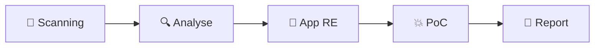

# 🔐 BLE Security Testing Guide

**Schwachstellen im Dialog: Sicherheitsanalyse der App-gesteuerten BLE-Kommunikation von Alltagsgeräten**

---

## Willkommen

Dieser Leitfaden bietet ein **systematisches Testkonzept** für die Sicherheitsanalyse von Bluetooth Low Energy (BLE) IoT-Geräten. Er basiert auf etablierten Frameworks wie dem **OWASP IoT Security Testing Guide (ISTG)** und **NIST SP 800-213**, kombiniert mit praxiserprobten Penetration-Testing-Methoden.

:::info Zielgruppe
- 🎓 **Studenten**: Bachelor-/Master-Arbeiten zu IoT-Sicherheit
- 🔬 **Sicherheitsforscher**: Systematische Schwachstellenanalyse
- 👨‍💻 **Entwickler**: Secure-by-Design-Prinzipien für BLE-Produkte
- 🛡️ **Penetration Tester**: Professionelle IoT-Security-Assessments
:::

## Was du lernen wirst



| Phase | Inhalt | Tools |
|-------|--------|-------|
| **Grundlagen** | BLE-Protokoll, GATT, Pairing | - |
| **Reconnaissance** | Scanning, Sniffing, Traffic-Analyse | nRF Sniffer, Wireshark |
| **App-Analyse** | APK Reverse Engineering, Key Extraction | JADX, Ghidra |
| **Exploitation** | PoC-Entwicklung, Replay-Attacks | blatann, Python |
| **Reporting** | CVSS-Scoring, Responsible Disclosure | LaTeX, Markdown |

## Praxis-Beispiele aus echter Forschung

Dieser Guide enthält **echte Fallstudien** aus Sicherheitsanalysen von:

### 🕶️ LED-Brille
- **Finding**: Hardcoded AES-128 Key mit Column-Major Transformation
- **CVSS**: 9.8 (Critical)
- **Impact**: Vollständige Gerätesteuerung ohne App

### 💡 LED-Strips
- **Finding**: XOR-"Verschlüsselung" mit hardcodiertem Key
- **CVSS**: 9.8 (Critical)
- **Impact**: Jedes Gerät in Reichweite steuerbar

### ⚖️ Smart Waage
- **Finding**: Gewicht im unverschlüsselten Advertising
- **CVSS**: 5.3 (Medium)
- **Impact**: Privacy-Verletzung im 10m Radius

## Voraussetzungen

| Anforderung | Level |
|-------------|-------|
| Linux/Terminal | Erforderlich |
| Python | Erforderlich |
| BLE-Kenntnisse | **Nicht erforderlich** (werden hier vermittelt!) |
| Hardware | nRF52840 USB Dongle (~10€) |

## Schnellstart

```bash
# 1. Hardware: nRF52840 USB Dongle (~10€)

# 2. Software installieren
pip install blatann pycryptodome

# 3. Ersten Scan starten
python3 scanner.py /dev/ttyACM0
```

## Navigation

| Bereich | Inhalt |
|---------|--------|
| 📘 **Tutorials** | Schritt-für-Schritt-Anleitung |
| 🧠 **BLE Grundlagen** | Protokoll-Referenz |
| 🔬 **Fallstudien** | Echte Sicherheitsanalysen |
| 📂 **Downloads** | Scripts, Templates |

---

:::tip Nächster Schritt
Beginne mit den [Voraussetzungen](./prerequisites), um deine Testumgebung einzurichten.
:::
