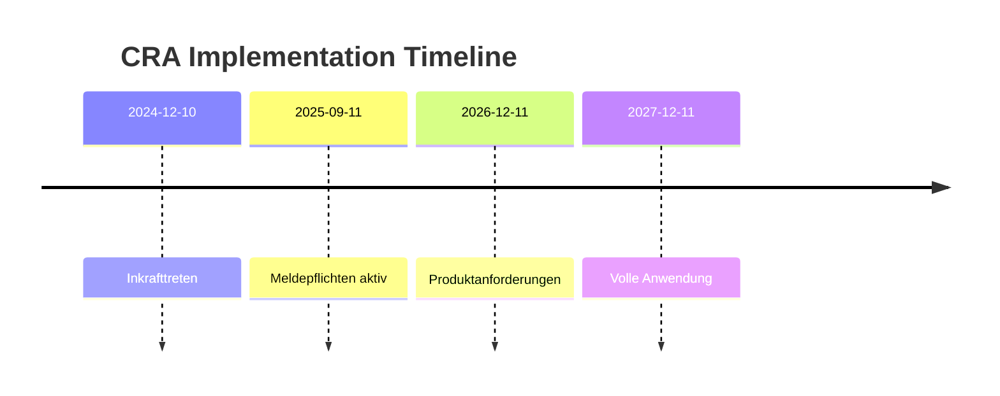
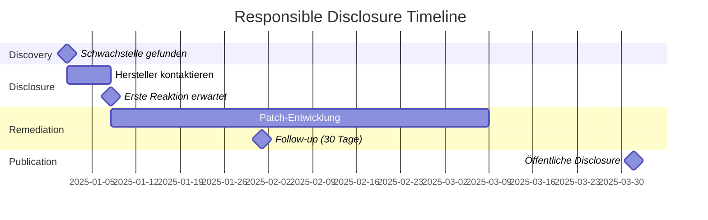

# Rechtlicher Rahmen

:::danger Wichtig
Dieser Abschnitt dient der **Orientierung** und ersetzt keine Rechtsberatung. Bei Unsicherheiten konsultiere einen Fachanwalt für IT-Recht.
:::

## Deutsches Strafrecht (StGB)

### §202a - Ausspähen von Daten

```
(1) Wer unbefugt sich oder einem anderen Zugang zu Daten, die nicht 
für ihn bestimmt und die gegen unberechtigten Zugang besonders 
gesichert sind, unter Überwindung der Zugangssicherung verschafft, 
wird mit Freiheitsstrafe bis zu drei Jahren oder mit Geldstrafe bestraft.
```

**BLE-Relevanz**:
- **"Besonders gesichert"**: Verschlüsselung, Pairing, Authentication
- **"Überwindung"**: Aktives Umgehen von Sicherheitsmechanismen
- Passives Sniffing von **unverschlüsselten** Advertising-Paketen: **Grauzone**
- Abfangen **verschlüsselter** Verbindungen mit LTK-Extraktion: **Problematisch**

### §202b - Abfangen von Daten

```
Wer unbefugt sich oder einem anderen unter Anwendung von technischen 
Mitteln nicht für ihn bestimmte Daten aus einer nichtöffentlichen 
Datenübermittlung verschafft, wird mit Freiheitsstrafe bis zu zwei 
Jahren oder mit Geldstrafe bestraft.
```

**BLE-Relevanz**:
- BLE-Sniffing mit nRF Dongle = "technische Mittel"
- Gilt für **nicht-öffentliche** Übertragungen (Punkt-zu-Punkt-Verbindungen)
- Advertising auf öffentlichen Kanälen: **Umstritten**

### §202c - "Hackerparagraph"

```
(1) Wer eine Straftat nach § 202a oder § 202b vorbereitet, indem er
1. Passwörter oder sonstige Sicherungscodes, die den Zugang zu Daten 
   ermöglichen, oder
2. Computerprogramme, deren Zweck die Begehung einer solchen Tat ist,
herstellt, sich oder einem anderen verschafft, verkauft, einem anderen 
überlässt, verbreitet oder sonst zugänglich macht, wird mit Freiheits-
strafe bis zu zwei Jahren oder mit Geldstrafe bestraft.
```

**BLE-Relevanz**:
- **Dual-Use-Tools** (Wireshark, nRF Sniffer): Nicht erfasst
- **Zweckbestimmung** und **Absicht** entscheidend (BVerfG 2009)
- Sicherheitsforschung mit legitimer Absicht: **Erlaubt**
- Key-Extraction-Tools: **Grauzone** (Zweck entscheidend)

## Geplante Gesetzesreform (November 2024)

Das Bundesjustizministerium hat am 4. November 2024 einen **Gesetzentwurf zur Modernisierung des Computerstrafrechts** veröffentlicht.

### Neuer §202a Abs. 3 StGB-E (Safe Harbor)

```
Die Handlung ist nicht unbefugt, wenn sie erfolgt, um eine 
Schwachstelle oder ein anderes Sicherheitsrisiko eines 
informationstechnischen Systems festzustellen, und die Person 
die Absicht hat, den Verantwortlichen zu unterrichten.
```

**Voraussetzungen für Safe Harbor**:

1. ✅ **Ziel**: Identifikation einer Sicherheitslücke
2. ✅ **Absicht**: Meldung an verantwortliche Stelle
3. ✅ **Verhältnismäßigkeit**: Notwendige technische Maßnahmen

:::info Status
Stand November 2025: Der Gesetzentwurf ist noch nicht in Kraft getreten. Die aktuelle Rechtslage bleibt bis zur Verabschiedung bestehen.
:::

## DSGVO-Aspekte

### Personenbezogene Daten in BLE

| Datenart | Personenbezug | Beispiel |
|----------|---------------|----------|
| MAC-Adresse | Ja (indirekt) | Tracking möglich |
| Gerätename | Möglich | "Elias's iPhone" |
| Gesundheitsdaten | Ja (Art. 9) | Gewicht, Herzfrequenz |
| Standort | Ja | BLE Beacons |

### Rechtsgrundlagen für Sicherheitsforschung

```
Art. 6(1)(f) DSGVO - Berechtigtes Interesse
├── Interesse: IT-Sicherheitsforschung
├── Abwägung: Sicherheit vs. Privatsphäre
└── Maßnahmen: Pseudonymisierung, Minimierung

Art. 89 DSGVO / §27 BDSG - Forschungsausnahme
├── Wissenschaftliche Forschung
├── Technisch-organisatorische Maßnahmen
└── Erforderlichkeit der Verarbeitung
```

### Praktische Anforderungen

1. **Datenschutz-Folgenabschätzung** bei Hochrisiko-Verarbeitung
2. **Pseudonymisierung** von MAC-Adressen in Veröffentlichungen
3. **Verarbeitungsverzeichnis** führen (Art. 30 DSGVO)
4. **Löschfristen** definieren und einhalten

## EU Cyber Resilience Act (CRA)

Die **Verordnung (EU) 2024/2847** ist am 10.12.2024 in Kraft getreten.

### Timeline



### Relevante Artikel für Sicherheitsforscher

**Recital 80**: 
> Hersteller sollten Sicherheitsforscher ermutigen und keine 
> Vergeltungsmaßnahmen ergreifen.

**Artikel 13 (Vulnerability Handling)**:
- Hersteller müssen CVD-Prozess etablieren
- Meldung aktiv ausgenutzter Schwachstellen an CSIRT: **24 Stunden**
- Kostenlose Sicherheitsupdates: **mindestens 5 Jahre**

## Best Practices für legale Sicherheitsforschung

### ✅ Erlaubt

```
✓ Analyse eigener Geräte
✓ Passives Scanning öffentlicher Advertising-Pakete
✓ Reverse Engineering zur Interoperabilität (§69e UrhG)
✓ Dokumentation und Veröffentlichung (nach Disclosure)
✓ Entwicklung von Sicherheitstools (mit legitimer Absicht)
```

### ⚠️ Grauzone

```
? Sniffing fremder Verbindungen (auch unverschlüsselt)
? Key-Extraction aus fremden Apps
? PoC-Entwicklung für fremde Systeme
```

### ❌ Verboten

```
✗ Angriffe auf fremde Geräte ohne Erlaubnis
✗ Extraktion von Zugangsdaten
✗ Denial-of-Service Angriffe
✗ Verbreitung von Exploits ohne Disclosure
```

## Responsible Disclosure

### BSI als Koordinator

Das BSI bietet einen **Coordinated Vulnerability Disclosure (CVD)** Prozess:

📧 **Kontakt**: vulnerability@bsi.bund.de

### Standard-Timeline



### Timeline-Varianten

| Organisation | Standard-Frist | Verlängerung |
|--------------|----------------|--------------|
| Google Project Zero | 90 Tage | +14 bei aktivem Patch |
| ZDI | 120 Tage | Nach Vereinbarung |
| CERT/CC | 45 Tage | Nach Vereinbarung |
| BSI | Flexibel | Nach Abstimmung |

### Disclosure-Template

```markdown
# Vulnerability Report

## Summary
- **Product**: [Gerätename/App]
- **Vendor**: [Hersteller]
- **Severity**: [Critical/High/Medium/Low]
- **CVSS**: [Score] ([Vector])

## Description
[Kurze Beschreibung der Schwachstelle]

## Impact
[Was kann ein Angreifer erreichen?]

## Proof of Concept
[Minimal-PoC, keine funktionsfähigen Exploits!]

## Remediation
[Empfohlene Gegenmaßnahmen]

## Timeline
- YYYY-MM-DD: Schwachstelle entdeckt
- YYYY-MM-DD: Vendor kontaktiert
- YYYY-MM-DD: Vendor-Reaktion
- YYYY-MM-DD: Geplante Veröffentlichung

## Credit
[Dein Name/Pseudonym]

## Contact
[E-Mail für Rückfragen]
```

## Universitäre Forschung

### Ethik-Genehmigung

Für Forschungsprojekte an Universitäten:

1. **Ethikkommission** informieren (bei personenbezogenen Daten)
2. **Betreuer** in Sicherheitsaspekte einbinden
3. **Testumgebung** dokumentieren
4. **Nur eigene Hardware** verwenden

### Publikation

Bei Veröffentlichung der Ergebnisse:

- ✅ Schwachstellen **abstrahieren** (keine nutzbaren Exploits)
- ✅ **Pseudonymisierte** Beispiele verwenden
- ✅ **Responsible Disclosure** vor Publikation
- ✅ **Positive Sicherheitsbeiträge** betonen

---

:::warning Zusammenfassung
1. **Eigene Geräte**: Weitgehend erlaubt
2. **Fremde Geräte**: Nur mit Genehmigung
3. **Disclosure**: Immer responsible!
4. **Im Zweifel**: Rechtsberatung einholen
:::
