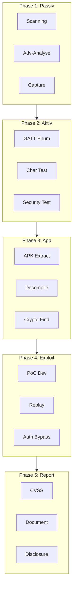
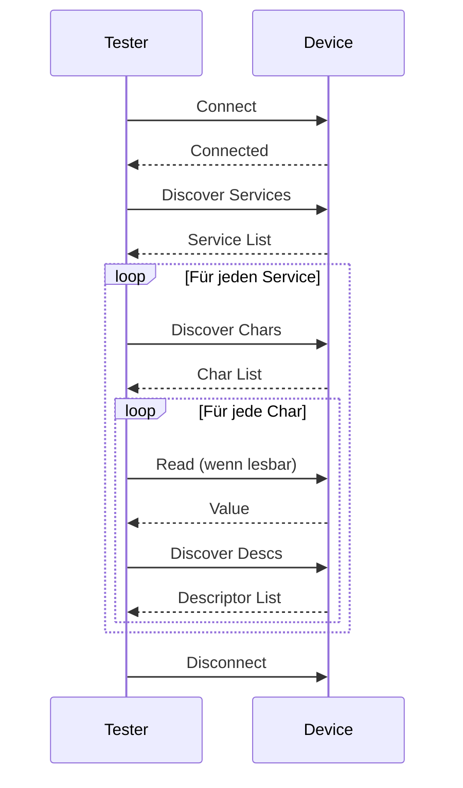
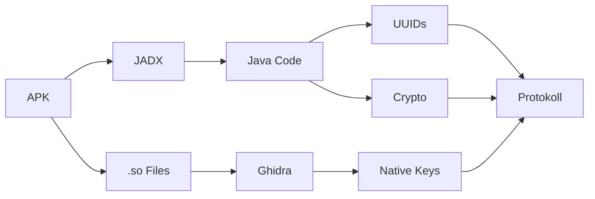

# Testmethodik

Eine strukturierte Testmethodik ist essentiell für reproduzierbare und vollständige Sicherheitsanalysen.

## Framework-Grundlagen

Diese Methodik basiert auf etablierten Standards:

| Standard | Organisation | Fokus |
|----------|--------------|-------|
| **OWASP ISTG v1.0** | OWASP | IoT Security Testing |
| **NIST SP 800-213** | NIST | IoT Device Security |
| **BSI TR-03148** | BSI | Smart Home Security |
| **ETSI EN 303 645** | ETSI | Consumer IoT Security |

## Der 5-Phasen-Prozess



## Phase 1: Passive Reconnaissance

**Ziel**: Informationen sammeln ohne aktive Interaktion mit dem Gerät.

### Aktivitäten

| Aktivität | Tool | Dauer | Output |
|-----------|------|-------|--------|
| BLE Scanning | blatann, hcitool | 10 min | Geräteliste, MAC, RSSI |
| Advertising-Analyse | Wireshark, Python | 30 min | AD Types, Manufacturer Data |
| Traffic Capture | nRF Sniffer | 1-2 h | PCAP mit App-Traffic |
| Umgebungsanalyse | - | 15 min | Andere BLE-Geräte |

### Scan-Checkliste

```markdown
## Phase 1 Checkliste

### Geräteinformationen
- [ ] MAC-Adresse notiert
- [ ] Gerätename (Local Name) erfasst
- [ ] TX Power Level
- [ ] Advertising-Intervall gemessen
- [ ] Advertising-Typ identifiziert

### Advertising-Daten
- [ ] Service UUIDs extrahiert
- [ ] Manufacturer Data analysiert
- [ ] Flags dokumentiert
- [ ] Sensible Daten im Advertising? (Privacy-Leak)

### Traffic Capture
- [ ] App-Start aufgezeichnet
- [ ] Verbindungsaufbau erfasst
- [ ] Alle App-Funktionen durchgespielt
- [ ] Disconnect aufgezeichnet
```

### Erwartete Ergebnisse

Nach Phase 1 solltest du haben:

1. **Geräte-Steckbrief** mit allen Advertising-Informationen
2. **PCAP-Datei** mit vollständiger Kommunikation
3. **Erste Schwachstellen-Hypothesen** (z.B. Privacy-Leaks)

## Phase 2: Aktive Analyse

**Ziel**: Direkte Interaktion mit dem Gerät zur GATT-Analyse.

### Aktivitäten

| Aktivität | Tool | Dauer | Output |
|-----------|------|-------|--------|
| GATT Enumeration | blatann, gatttool | 30 min | Service/Char-Liste |
| Characteristic Testing | blatann | 1-2 h | Funktionsanalyse |
| Security Level Testing | gatttool | 30 min | Zugriffsmatrix |
| Fuzzing (optional) | Custom Scripts | 2-4 h | Crash-Reports |

### GATT Enumeration Workflow



### Security Level Matrix

Teste jeden Security Level für jede Characteristic:

| Characteristic | Level 1 | Level 2 | Level 3 | Ergebnis |
|----------------|---------|---------|---------|----------|
| 0x0012 (Cmd) | ✓ | ✓ | ✓ | **Keine Auth!** |
| 0x0015 (Data) | ✓ | ✓ | ✓ | **Keine Auth!** |
| 0x001b (Notify) | ✓ | ✓ | ✓ | **Keine Auth!** |

## Phase 3: App-Analyse

**Ziel**: Protokoll und Verschlüsselung aus der Companion-App extrahieren.

### Aktivitäten

| Aktivität | Tool | Dauer | Output |
|-----------|------|-------|--------|
| APK Extraction | ADB | 15 min | APK-Datei |
| Decompilation | JADX | 30 min | Java-Quellcode |
| UUID Extraction | grep, JADX | 30 min | UUID-Liste |
| Crypto Analysis | JADX, Ghidra | 2-4 h | Keys, Algorithmen |
| Native Analysis | Ghidra | 2-6 h | Native Keys |

### APK-Analyse Workflow



### Suchmuster für JADX

```java
// UUIDs finden
"0000fff0"
"UUID.fromString"
"getService"
"getCharacteristic"

// Verschlüsselung finden
"encrypt"
"decrypt"
"AES"
"key"
"SecretKey"
"Cipher"

// Native Libraries
"System.loadLibrary"
"native"
```

## Phase 4: Exploitation

**Ziel**: Schwachstellen mit Proof-of-Concept validieren.

### Aktivitäten

| Aktivität | Tool | Dauer | Output |
|-----------|------|-------|--------|
| PoC Development | Python/blatann | 2-4 h | Funktionierender PoC |
| Replay Attack Test | Wireshark + blatann | 1 h | Replay-Validierung |
| Auth Bypass Test | blatann | 1 h | Bypass-Validierung |
| Key Validation | PyCryptodome | 1 h | Entschlüsselung |

### PoC-Struktur

```python
#!/usr/bin/env python3
"""
PoC für [Vulnerability Name]
Target: [Gerätename]
CVE: [falls vorhanden]

DISCLAIMER: Nur für autorisierte Tests!
"""

import sys
from blatann import BleDevice

# === KONFIGURATION ===
TARGET_MAC = "AA:BB:CC:DD:EE:FF"
SERVICE_UUID = "0000fff0-..."
CHAR_UUID = "0000fff3-..."

# === EXTRAHIERTE KEYS ===
ENCRYPTION_KEY = bytes.fromhex("...")

def exploit():
    """Hauptfunktion des Exploits"""
    # 1. Verbinden
    # 2. Service finden
    # 3. Payload senden
    # 4. Ergebnis verifizieren
    pass

if __name__ == "__main__":
    exploit()
```

### Validierungskriterien

Ein PoC ist **erfolgreich** wenn:

- [ ] Gerät reagiert wie erwartet
- [ ] Verhalten identisch zur Original-App
- [ ] Reproduzierbar (mindestens 3x getestet)
- [ ] Minimal (keine unnötigen Features)
- [ ] Dokumentiert

## Phase 5: Reporting

**Ziel**: Professionelle Dokumentation und verantwortungsvolle Offenlegung.

### Aktivitäten

| Aktivität | Tool | Dauer | Output |
|-----------|------|-------|--------|
| Vulnerability Assessment | CVSS Calculator | 30 min | Severity Ratings |
| Report Writing | LaTeX/Markdown | 2-4 h | Assessment Report |
| PoC Documentation | - | 1 h | Code + Anleitung |
| Responsible Disclosure | E-Mail | ongoing | Vendor-Kommunikation |

### Report-Struktur

```
1. Executive Summary
   - Kritische Findings
   - Gesamtrisiko
   - Empfehlungen

2. Scope & Methodology
   - Getestete Geräte/Apps
   - Verwendete Tools
   - Testumgebung

3. Findings
   - V-001: [Name]
     - CVSS Score
     - Beschreibung
     - Impact
     - PoC Reference
     - Remediation

4. Attack Scenarios
   - Realistische Angriffsszenarien

5. Recommendations
   - Priorisierte Maßnahmen

6. Appendix
   - PoC Code
   - Raw Data
   - Screenshots
```

## OWASP ISTG Mapping

| ISTG Category | Unsere Phase | Tests |
|---------------|--------------|-------|
| ISTG-FW-* | Phase 3 | Firmware/App-Analyse |
| ISTG-DES-* | Phase 1, 2 | Design-Schwächen |
| ISTG-WRLS-AUTH* | Phase 2, 4 | Authentifizierung |
| ISTG-WRLS-CRYPT* | Phase 3, 4 | Verschlüsselung |
| ISTG-WRLS-SCRT* | Phase 3 | Hardcoded Secrets |
| ISTG-WRLS-INPV* | Phase 4 | Input Validation |

## Zeitplanung

### Minimal (schnelle Einschätzung)

| Phase | Aktivitäten | Zeit |
|-------|-------------|------|
| Phase 1 | Scan + Quick Capture | 2 h |
| Phase 2 | GATT Enumeration | 1 h |
| Phase 3 | JADX Quick Look | 2 h |
| Phase 4 | Einfacher PoC | 3 h |
| Phase 5 | Kurzer Report | 2 h |
| **Gesamt** | | **10 h** |

### Standard (vollständige Analyse)

| Phase | Aktivitäten | Zeit |
|-------|-------------|------|
| Phase 1 | Vollständige Reconnaissance | 4 h |
| Phase 2 | Alle Characteristics | 3 h |
| Phase 3 | JADX + Ghidra | 6 h |
| Phase 4 | Vollständiger PoC | 5 h |
| Phase 5 | Ausführlicher Report | 4 h |
| **Gesamt** | | **22 h** |

### Umfassend (Deep Dive)

| Phase | Aktivitäten | Zeit |
|-------|-------------|------|
| Phase 1 | + Langzeit-Monitoring | 8 h |
| Phase 2 | + Fuzzing | 6 h |
| Phase 3 | + Frida Dynamic Analysis | 10 h |
| Phase 4 | + Multiple Attack Vectors | 8 h |
| Phase 5 | + Präsentation | 6 h |
| **Gesamt** | | **38 h** |

## Checkliste pro Gerät

```markdown
## BLE Security Assessment Checkliste

### Gerät: [Name]
### Datum: [YYYY-MM-DD]
### Analyst: [Name]

### Phase 1: Passive Reconnaissance
- [ ] BLE Scan durchgeführt
- [ ] Advertising-Daten dokumentiert
- [ ] Traffic Capture erstellt
- [ ] Privacy-Leaks geprüft

### Phase 2: Aktive Analyse
- [ ] GATT vollständig enumeriert
- [ ] Alle Characteristics getestet
- [ ] Security Levels geprüft
- [ ] Pairing-Verhalten dokumentiert

### Phase 3: App-Analyse
- [ ] APK extrahiert
- [ ] Code dekompiliert
- [ ] UUIDs extrahiert
- [ ] Verschlüsselung analysiert
- [ ] Native Libraries untersucht

### Phase 4: Exploitation
- [ ] PoC entwickelt
- [ ] Replay-Angriffe getestet
- [ ] Auth-Bypass versucht
- [ ] Alle Findings validiert

### Phase 5: Reporting
- [ ] CVSS Scores berechnet
- [ ] Report geschrieben
- [ ] PoC dokumentiert
- [ ] Disclosure geplant
```

---

:::tip Nächster Schritt
Beginne mit dem [Hardware-Setup](./setup/hardware).
:::
