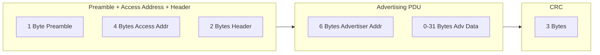

# Advertising-Analyse

BLE-Geräte senden **Advertising-Pakete** um ihre Präsenz bekannt zu geben. Diese Pakete können wertvolle Informationen für die Sicherheitsanalyse enthalten.

## Advertising-Paket-Struktur



## Advertising Data (AD) Typen

Die Advertising-Daten bestehen aus **Type-Length-Value (TLV)** Strukturen:

| Type | Beschreibung | Beispiel |
|------|--------------|----------|
| `0x01` | Flags | `0x06` (LE General Discoverable) |
| `0x02` | 16-bit Service UUIDs (teilweise) | `0xf0 0xff` (0xfff0) |
| `0x03` | 16-bit Service UUIDs (komplett) | |
| `0x06` | 128-bit Service UUIDs (teilweise) | |
| `0x07` | 128-bit Service UUIDs (komplett) | |
| `0x08` | Shortened Local Name | `"LED"` |
| `0x09` | Complete Local Name | `"LED-A1B2C3"` |
| `0xFF` | Manufacturer Specific Data | Vendor-spezifisch |

## Manufacturer Data analysieren

Der wichtigste Teil für Security-Analysen ist oft die **Manufacturer Specific Data**:

```
[Länge] [Typ=0xFF] [Company ID (2 Bytes LE)] [Payload]
```

### Beispiel: LED Strips

```python
import struct

# Captured Manufacturer Data
raw = bytes.fromhex("0b ff e8 be b0 01 02 03 04 05 06")

# Parsen
length = raw[0]      # 0x0b = 11 Bytes
ad_type = raw[1]     # 0xff = Manufacturer Data
company_id = struct.unpack('<H', raw[2:4])[0]  # 0xBEE8 (Little Endian)
payload = raw[4:]    # b0 01 02 03 04 05 06

print(f"Company ID: 0x{company_id:04X}")
print(f"Payload: {payload.hex()}")
```

### Company ID nachschlagen

```bash
# Bluetooth SIG Company Identifiers:
# https://www.bluetooth.com/specifications/assigned-numbers/company-identifiers/

# Häufige IDs:
# 0x004C - Apple
# 0x0006 - Microsoft
# 0x00E0 - Google
# 0xBEE8 - Unregistered (Custom)
```

## Verschlüsselte Advertising-Daten

Manche Geräte verschlüsseln ihre Advertising-Daten:

### Fallstudie: LED Strips (XOR-Verschlüsselung)

```python
# Hardcoded XOR Key (aus APK extrahiert)
XOR_KEY = bytes([89, 76, 90, 75, 53, 49, 33, 41, 62, 72, 64, 
                 118, 100, 98, 81, 68, 94, 68, 63])

def decrypt_advertising(encrypted: bytes, counter: int) -> bytes:
    """
    Entschlüsselt Advertising-Daten der LED Strips
    
    Args:
        encrypted: Verschlüsselte Daten (ohne Company ID)
        counter: dataNum aus Byte 0
    """
    key = XOR_KEY + bytes([counter])
    result = bytearray(encrypted)
    
    # XOR ab Byte 1
    for i in range(1, min(len(result), 25)):
        for k in key:
            result[i] ^= k
    
    return bytes(result)

# Beispiel
encrypted = bytes.fromhex("2ab3c4d5e6f7081920")
counter = encrypted[0]  # dataNum
decrypted = decrypt_advertising(encrypted, counter)

# Marker prüfen
if len(decrypted) > 1 and decrypted[1] == 0xB0:
    print("✅ Erfolgreich entschlüsselt!")
    if len(decrypted) >= 13:
        print(f"Command: {decrypted[4:13].hex()}")
```

## Advertising-Analyse mit Wireshark

### Filter für Advertising

```wireshark
# Nur Advertising-Pakete
btle.advertising_header

# Bestimmter Advertising-Typ
btle.advertising_header.pdu_type == 0x00  # ADV_IND

# Nach Gerätenamen filtern
btcommon.eir_ad.entry.device_name contains "GLASS"

# Nach Manufacturer ID
btcommon.eir_ad.entry.company_id == 0xbee8
```

### Felder exportieren

```bash
# Manufacturer Data extrahieren
tshark -r capture.pcapng \
    -Y "btle.advertising_header" \
    -T fields \
    -e frame.number \
    -e btle.advertising_address \
    -e btcommon.eir_ad.entry.data \
    > advertising_data.txt
```

## Python-Analyse-Tool

```python
#!/usr/bin/env python3
"""
Advertising Data Analyzer
Analysiert und dekodiert BLE Advertising-Pakete
"""

import struct
from typing import Dict, List, Optional

AD_TYPES = {
    0x01: "Flags",
    0x02: "16-bit UUIDs (Incomplete)",
    0x03: "16-bit UUIDs (Complete)",
    0x06: "128-bit UUIDs (Incomplete)",
    0x07: "128-bit UUIDs (Complete)",
    0x08: "Short Name",
    0x09: "Complete Name",
    0x0A: "TX Power Level",
    0xFF: "Manufacturer Data",
}

def parse_advertising_data(raw: bytes) -> Dict:
    """
    Parst BLE Advertising Data in strukturiertes Format
    """
    result = {"entries": []}
    offset = 0
    
    while offset < len(raw):
        if offset + 1 >= len(raw):
            break
            
        length = raw[offset]
        if length == 0:
            break
            
        ad_type = raw[offset + 1]
        data = raw[offset + 2 : offset + 1 + length]
        
        entry = {
            "type": ad_type,
            "type_name": AD_TYPES.get(ad_type, f"Unknown (0x{ad_type:02X})"),
            "data": data,
        }
        
        # Spezielle Dekodierung
        if ad_type == 0x01:  # Flags
            entry["decoded"] = decode_flags(data[0])
        elif ad_type in (0x08, 0x09):  # Name
            entry["decoded"] = data.decode('utf-8', errors='replace')
        elif ad_type == 0x0A:  # TX Power
            entry["decoded"] = f"{struct.unpack('b', data)[0]} dBm"
        elif ad_type == 0xFF:  # Manufacturer
            if len(data) >= 2:
                company_id = struct.unpack('<H', data[:2])[0]
                entry["company_id"] = f"0x{company_id:04X}"
                entry["payload"] = data[2:]
        
        result["entries"].append(entry)
        offset += 1 + length
    
    return result

def decode_flags(flags: int) -> List[str]:
    """Dekodiert Advertising Flags"""
    result = []
    if flags & 0x01:
        result.append("LE Limited Discoverable")
    if flags & 0x02:
        result.append("LE General Discoverable")
    if flags & 0x04:
        result.append("BR/EDR Not Supported")
    if flags & 0x08:
        result.append("LE + BR/EDR Controller")
    if flags & 0x10:
        result.append("LE + BR/EDR Host")
    return result

# Beispiel
raw_adv = bytes.fromhex("02 01 06 09 09 4c 45 44 2d 41 42 43 44 05 ff e8 be 01 02")
parsed = parse_advertising_data(raw_adv)

for entry in parsed["entries"]:
    print(f"\n{entry['type_name']}:")
    print(f"  Raw: {entry['data'].hex()}")
    if "decoded" in entry:
        print(f"  Decoded: {entry['decoded']}")
    if "company_id" in entry:
        print(f"  Company: {entry['company_id']}")
        print(f"  Payload: {entry['payload'].hex()}")
```

## Sicherheits-Checkliste Advertising

- [ ] **Sensible Daten im Advertising?** (Gewicht, Gesundheitsdaten, etc.)
- [ ] **MAC-Adresse statisch?** (Privacy/Tracking-Risiko)
- [ ] **Verschlüsselung vorhanden?** (Falls ja: welche?)
- [ ] **Company ID registriert?** (Unregistriert = oft custom/unsicher)
- [ ] **Advertising-Intervall?** (Kurz = mehr Daten, aber Batterie)

---

:::tip Nächster Schritt
Weiter zur [Wireshark Capture](./wireshark-capture) für detaillierte Traffic-Analyse.
:::
