# Passives Scanning

Die erste Phase jeder BLE-Sicherheitsanalyse: **Informationen sammeln ohne aktive Interaktion**.

## Warum passiv beginnen?

```mermaid
flowchart LR
    A[Passiv] --> B[Kein Verdacht]
    A --> C[Keine Logs]
    A --> D[Keine Interferenz]
    B --> E[Vollständiges Bild]
    C --> E
    D --> E
```



- **Unentdeckt** bleiben
- **Vollständiges** Advertising-Verhalten beobachten
- Potentielle **Privacy-Leaks** identifizieren
- Geräte-Landschaft verstehen

## Scanning-Methoden

### 1. bluetoothctl (Empfohlen)

Die moderne Methode für Bluetooth LE Scanning:

```bash
# Interaktiv
bluetoothctl
[bluetooth]# scan le
# Warte auf Ergebnisse...
[bluetooth]# devices
[bluetooth]# info AA:BB:CC:DD:EE:FF
[bluetooth]# scan off
[bluetooth]# quit

# Oder als Einzeiler
bluetoothctl scan le
```

### 2. hcitool (Legacy - nur Bluetooth 4.x)

:::caution Veraltet
`hcitool` ist **deprecated** und funktioniert **nicht** mit Bluetooth 5.x Adaptern!
Bei Bluetooth 5.x Geräten erhältst du: `Set scan parameters failed: Input/output error`
Verwende stattdessen `bluetoothctl scan le`.
:::

```bash
# Nur für ältere Bluetooth 4.x Adapter:
sudo hciconfig hci0 up
sudo hcitool lescan
```

### 3. blatann (Skript-basiert)

```python
#!/usr/bin/env python3
"""
Passiver BLE Scanner
Sammelt Informationen ohne Verbindungsaufbau
"""

import sys
import time
from blatann import BleDevice
from blatann.utils import setup_logger

def scan_passive(serial_port, duration=30):
    setup_logger(level="INFO")
    
    ble_device = BleDevice(serial_port)
    ble_device.configure()
    ble_device.open()
    time.sleep(1)
    
    devices = {}
    
    def on_adv(sender, report):
        addr = str(report.peer_address)
        adv = report.advertise_data
        
        # Informationen sammeln
        info = {
            "name": adv.local_name or report.device_name,
            "rssi": report.rssi,
            "services": [str(u) for u in adv.service_uuids],
            "manufacturer_data": adv.manufacturer_data.hex() if adv.manufacturer_data else None,
        }
        
        if addr not in devices:
            devices[addr] = info
            print(f"\n[NEW] {addr}")
            print(f"  Name: {info['name']}")
            print(f"  RSSI: {info['rssi']} dBm")
            if info['services']:
                print(f"  Services: {', '.join(info['services'])}")
            if info['manufacturer_data']:
                print(f"  Mfg Data: {info['manufacturer_data']}")
    
    ble_device.scanner.on_scan_received.register(on_adv)
    
    print(f"🔍 Passiver Scan ({duration}s)...")
    print("=" * 50)
    
    ble_device.scanner.set_default_scan_params(timeout_seconds=duration)
    ble_device.scanner.start_scan().wait(timeout=duration + 5)
    
    print("=" * 50)
    print(f"\n✅ {len(devices)} eindeutige Geräte")
    
    ble_device.close()
    return devices

if __name__ == "__main__":
    port = sys.argv[1] if len(sys.argv) > 1 else "/dev/ttyACM0"
    scan_passive(port)
```

## Was du beobachten solltest

### Advertising-Typen

| Typ | Beschreibung | Security-Relevanz |
|-----|--------------|-------------------|
| **ADV_IND** | Connectable, scannable | Standard - verbindbar |
| **ADV_DIRECT_IND** | Directed advertising | Kann MAC-Adresse leaken |
| **ADV_SCAN_IND** | Scannable, nicht connectable | Nur Daten, keine Verbindung |
| **ADV_NONCONN_IND** | Nicht connectable | Beacons, Broadcast-only |

### Manufacturer Data

Viele Geräte senden **sensible Daten** im Advertising:

```python
# Beispiel: Smart Waage sendet Gewicht im Advertising!
manufacturer_data = bytes.fromhex("c005 1234 5678")
#                                  ^ID  ^Gewicht ^Impedanz
```

:::danger Privacy-Leak!
Die **Lebenlang Waage** sendet das aktuelle Gewicht unverschlüsselt im Advertising-Paket - sichtbar für jeden in Reichweite!
:::

### Service UUIDs

```python
# Standard Bluetooth SIG UUIDs (16-bit)
"0x180F"  # Battery Service
"0x180A"  # Device Information
"0x1800"  # Generic Access

# Custom/Vendor UUIDs (128-bit)
"0000fff0-0000-1000-8000-00805f9b34fb"  # Oft für Custom Services
```

## Fallstudie: Smart Waage Privacy-Leak

```python
#!/usr/bin/env python3
"""
Privacy-Scanner für Smart Waagen
Demonstriert wie sensible Daten im Advertising geleakt werden
"""

import sys
import struct
from blatann import BleDevice

TARGET_NAME = "Yoda1"
TARGET_MFG_ID = 0x05C0

def scan_waage(serial_port):
    ble_device = BleDevice(serial_port)
    ble_device.configure()
    ble_device.open()
    
    def on_adv(sender, report):
        adv = report.advertise_data
        name = adv.local_name
        
        if name and TARGET_NAME.lower() in name.lower():
            mfg_data = adv.manufacturer_data
            
            if mfg_data and len(mfg_data) >= 6:
                # Gewicht dekodieren (Big Endian)
                raw_weight = struct.unpack('>H', mfg_data[2:4])[0]
                weight_kg = raw_weight / 100.0
                
                # Impedanz dekodieren
                raw_impedance = struct.unpack('>H', mfg_data[4:6])[0]
                
                if weight_kg > 5.0:  # Filter leere Messungen
                    print(f"\n🚨 PRIVACY-LEAK DETEKTIERT!")
                    print(f"   Gerät: {report.peer_address}")
                    print(f"   GEWICHT: {weight_kg:.2f} kg")
                    print(f"   IMPEDANZ: {raw_impedance} Ohm")
    
    ble_device.scanner.on_scan_received.register(on_adv)
    
    print(f"🔍 Scanne nach '{TARGET_NAME}'...")
    ble_device.scanner.start_scan().wait(timeout=60)
    
    ble_device.close()

if __name__ == "__main__":
    port = sys.argv[1] if len(sys.argv) > 1 else "/dev/ttyACM0"
    scan_waage(port)
```

## Dokumentation der Ergebnisse

### Template für Scan-Ergebnisse

```markdown
## Passive Reconnaissance - [Gerätename]

**Datum**: YYYY-MM-DD
**Dauer**: X Minuten
**Tool**: blatann / hcitool / nRF Sniffer

### Identifizierte Geräte

| MAC | Name | RSSI | Connectable | Services |
|-----|------|------|-------------|----------|
| AA:BB:CC:DD:EE:FF | Device1 | -65 | ✓ | 0xfff0 |

### Advertising-Analyse

- **Typ**: ADV_IND
- **Intervall**: ~100ms
- **Manufacturer ID**: 0xXXXX
- **Manufacturer Data**: `XX XX XX XX...`

### Potentielle Privacy-Issues

- [ ] Sensible Daten im Advertising?
- [ ] MAC-Adresse rotiert?
- [ ] Tracking möglich?

### Nächste Schritte

1. Wireshark Capture erstellen
2. Manufacturer Data analysieren
3. Aktive GATT-Enumeration
```

---

:::tip Nächster Schritt
Weiter zur [Advertising-Analyse](./advertising-analysis).
:::
