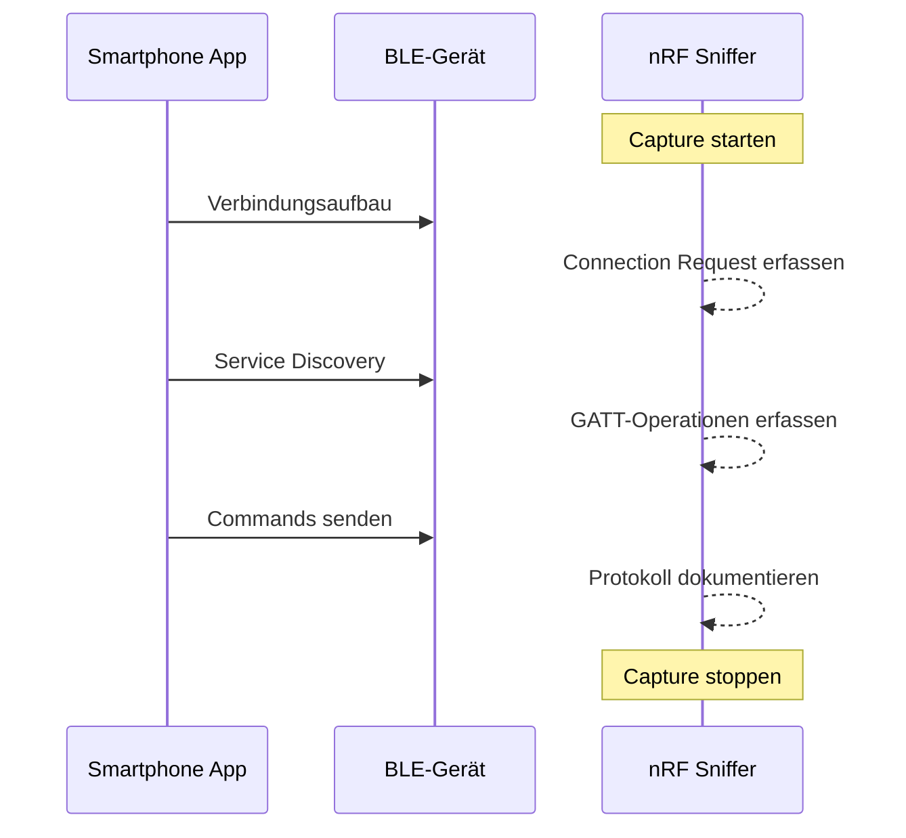

# Wireshark Capture

Eine professionelle Paketaufzeichnung ist die Grundlage jeder BLE-Sicherheitsanalyse.

## Capture starten

### Mit nRF Sniffer

1. **Wireshark öffnen**
2. **Capture → Options** (Ctrl+K)
3. **nRF Sniffer for Bluetooth LE** auswählen
4. **Start** klicken

### Via Kommandozeile

```bash
# Mit tshark (Wireshark CLI)
tshark -i "nRF Sniffer for Bluetooth LE" -w ble_capture.pcapng

# Mit Dauer (60 Sekunden)
timeout 60 tshark -i "nRF Sniffer for Bluetooth LE" -w ble_capture.pcapng
```

## Capture-Strategie



### Optimale Capture-Prozedur

1. **Sniffer starten** (vor dem Gerät einschalten)
2. **Gerät einschalten** → Advertising beobachten
3. **App öffnen** und verbinden lassen
4. **Alle Funktionen durchspielen** (Ein/Aus, Farbe, Modi, etc.)
5. **Capture stoppen** (ca. 1-5 Minuten)

## Display-Filter

### Grundlegende Filter

```wireshark
# Alle BLE-Pakete
btle

# Nur Advertising
btle.advertising_header

# Nur Datenpakete
btle.data_header

# ATT-Protokoll (GATT-Operationen)
btatt

# Sicherheits-Protokoll (Pairing)
btsmp
```

### GATT-spezifische Filter

```wireshark
# Write Requests (mit Response)
btatt.opcode == 0x12

# Write Commands (ohne Response)
btatt.opcode == 0x52

# Read Requests
btatt.opcode == 0x0a

# Read Responses
btatt.opcode == 0x0b

# Notifications
btatt.opcode == 0x1b

# Indications (mit Bestätigung)
btatt.opcode == 0x1d

# Error Responses
btatt.opcode == 0x01
```

### Filter kombinieren

```wireshark
# Writes an bestimmtes Handle
btatt.opcode == 0x12 && btatt.handle == 0x0012

# Alle Operationen für ein Gerät
btle.advertising_address == aa:bb:cc:dd:ee:ff

# Nur Daten-Payloads
btatt.value
```

## Capture analysieren

### ATT-Opcode Referenz

| Opcode | Name | Beschreibung |
|--------|------|--------------|
| `0x01` | Error Response | Fehlerantwort |
| `0x02` | Exchange MTU Request | MTU aushandeln |
| `0x03` | Exchange MTU Response | MTU-Antwort |
| `0x04` | Find Information Request | Handles finden |
| `0x08` | Read By Type Request | Nach Typ lesen |
| `0x0A` | Read Request | Wert lesen |
| `0x0B` | Read Response | Lese-Antwort |
| `0x12` | Write Request | Schreiben (mit Response) |
| `0x13` | Write Response | Schreib-Bestätigung |
| `0x52` | Write Command | Schreiben (ohne Response) |
| `0x1B` | Handle Value Notification | Notification |
| `0x1D` | Handle Value Indication | Indication |

### Paket-Analyse Beispiel

```
Frame 144: 27 bytes on wire
Bluetooth Low Energy Link Layer
    Access Address: 0x12345678
    Data Header
        LLID: Start of L2CAP or complete PDU (0x02)
        NESN: 1
        SN: 0
        MD: 0
        Length: 15
    
Bluetooth Attribute Protocol
    Opcode: Write Request (0x12)
    Handle: 0x0012
    Value: 7e 04 04 01 00 01 ff 00 ef
    
    ^^^ Dieser Wert ist das eigentliche Protokoll!
```

## Daten exportieren

### Als Text

```bash
# Alle ATT-Werte extrahieren
tshark -r capture.pcapng \
    -Y "btatt" \
    -T fields \
    -e frame.number \
    -e frame.time_relative \
    -e btatt.opcode \
    -e btatt.handle \
    -e btatt.value \
    > att_operations.txt
```

### Als JSON

```bash
# Vollständige Pakete als JSON
tshark -r capture.pcapng \
    -Y "btatt.opcode == 0x12" \
    -T json \
    > write_requests.json
```

### Python-Analyse

```python
#!/usr/bin/env python3
"""
Wireshark PCAP Analyzer für BLE
Extrahiert und analysiert ATT-Operationen
"""

import json
import subprocess
from collections import defaultdict

def extract_att_operations(pcap_file: str) -> list:
    """Extrahiert ATT-Operationen aus PCAP-Datei"""
    
    cmd = [
        "tshark", "-r", pcap_file,
        "-Y", "btatt",
        "-T", "json"
    ]
    
    result = subprocess.run(cmd, capture_output=True, text=True)
    packets = json.loads(result.stdout)
    
    operations = []
    for pkt in packets:
        layers = pkt.get("_source", {}).get("layers", {})
        
        if "btatt" in layers:
            btatt = layers["btatt"]
            op = {
                "frame": layers.get("frame", {}).get("frame.number"),
                "time": layers.get("frame", {}).get("frame.time_relative"),
                "opcode": btatt.get("btatt.opcode"),
                "handle": btatt.get("btatt.handle"),
                "value": btatt.get("btatt.value"),
            }
            operations.append(op)
    
    return operations

def analyze_protocol(operations: list):
    """Analysiert das Protokoll aus den Operationen"""
    
    # Nach Handle gruppieren
    by_handle = defaultdict(list)
    for op in operations:
        if op["handle"]:
            by_handle[op["handle"]].append(op)
    
    print("\n=== Handle-Analyse ===")
    for handle, ops in by_handle.items():
        print(f"\nHandle {handle}:")
        print(f"  Operationen: {len(ops)}")
        
        # Unique Values
        values = set(op["value"] for op in ops if op["value"])
        print(f"  Unique Values: {len(values)}")
        
        # Beispiele
        for v in list(values)[:3]:
            print(f"    {v}")

# Verwendung
if __name__ == "__main__":
    import sys
    pcap = sys.argv[1] if len(sys.argv) > 1 else "capture.pcapng"
    
    ops = extract_att_operations(pcap)
    print(f"Gefunden: {len(ops)} ATT-Operationen")
    
    analyze_protocol(ops)
```

## Capture dokumentieren

### Template

```markdown
## Wireshark Capture - [Gerätename]

**Datei**: capture_device_YYYYMMDD.pcapng
**Datum**: YYYY-MM-DD HH:MM
**Dauer**: X Minuten
**Pakete**: XXXX total

### Übersicht

| Metrik | Wert |
|--------|------|
| Advertising-Pakete | XXX |
| Connection Events | XXX |
| ATT Write Requests | XXX |
| ATT Notifications | XXX |

### Identifizierte Handles

| Handle | UUID | Operationen | Beschreibung |
|--------|------|-------------|--------------|
| 0x0012 | Custom | WRITE | Command Channel |
| 0x0015 | Custom | WRITE | Data Channel |
| 0x001b | Custom | NOTIFY | Response Channel |

### Protokoll-Sequenz

1. Verbindung aufgebaut
2. MTU Exchange (244 Bytes)
3. Service Discovery
4. Write auf 0x0012: `7e 04 04 01...` (Power On)
5. Notification von 0x001b: `...` (Bestätigung)

### Auffälligkeiten

- [ ] Verschlüsselung erkannt?
- [ ] Pairing durchgeführt?
- [ ] Replay-Anfälligkeit?
```

---

:::tip Nächster Schritt
Weiter zur [Phase 2: GATT Enumeration](../phase2/gatt-enumeration).
:::
