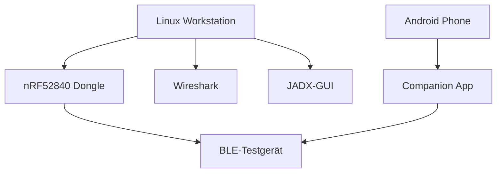

# Voraussetzungen

## Hardware-Anforderungen

### Essentiell

| Hardware | Preis | Verwendung |
|----------|-------|------------|
| **nRF52840 USB Dongle** | ~10€ | BLE-Sniffing, PoC-Entwicklung |
| **Linux-System** | - | Analyse-Workstation |
| **BLE-Testgerät** | variiert | Analyseziel (eigenes Gerät!) |

### Optional

| Hardware | Preis | Verwendung |
|----------|-------|------------|
| Ubertooth One | ~150€ | Erweitertes Sniffing, Legacy Pairing |
| Android-Smartphone | variiert | App-Installation, Traffic-Generierung |
| Raspberry Pi | ~50€ | Dedicated Sniffing Station |

## Software-Stack

### Basis-Installation

```bash
# Ubuntu/Debian
sudo apt update
sudo apt install -y \
    python3 python3-pip python3-venv \
    wireshark \
    adb \
    git \
    default-jdk  # Für JADX
```

### Python-Bibliotheken

```bash
# Virtuelle Umgebung (empfohlen)
python3 -m venv ble-security
source ble-security/bin/activate

# Kernbibliotheken
pip install blatann pycryptodome

# Zusätzliche Tools
pip install scapy pyserial
```

### Reverse Engineering Tools

| Tool | Installation | Zweck |
|------|--------------|-------|
| **JADX-GUI** | [GitHub Release](https://github.com/skylot/jadx/releases) | APK Decompilierung |
| **Ghidra** | [NSA GitHub](https://github.com/NationalSecurityAgency/ghidra) | Native Library Analyse |
| **Frida** | `pip install frida-tools` | Runtime Hooking (optional) |

### nRF Sniffer Setup

```bash
# nRF Util installieren
pip install nrfutil

# Sniffer-Plugin installieren
nrfutil install ble-sniffer

# Firmware flashen (Dongle im Bootloader-Modus)
nrfutil ble-sniffer bootstrap --serial-number <SERIAL>
```

## Kenntnisse-Check

### ✅ Erforderlich

- [ ] Linux-Kommandozeile navigieren
- [ ] Python-Skripte ausführen und modifizieren
- [ ] Package Manager verwenden (apt, pip)
- [ ] Wireshark grundlegend bedienen

### 📚 Wird hier vermittelt

- [ ] BLE-Protokoll (GATT, ATT, Services)
- [ ] UUID-System verstehen
- [ ] Pairing-Mechanismen
- [ ] APK Reverse Engineering
- [ ] PoC-Entwicklung mit blatann

### 🎯 Hilfreich (nicht erforderlich)

- [ ] AES/Kryptographie-Grundlagen
- [ ] ARM Assembly (für Ghidra)
- [ ] Android-Entwicklung

## Testumgebung einrichten



### Verzeichnisstruktur

```bash
mkdir -p ~/ble-research/{captures,apks,reports,scripts}

# Struktur:
# ~/ble-research/
# ├── captures/     # Wireshark .pcapng Dateien
# ├── apks/         # Extrahierte APK-Dateien
# ├── reports/      # Security Reports
# └── scripts/      # PoC-Skripte
```

---

:::tip Nächster Schritt
Weiter zur [Testmethodik](./methodology), um den systematischen Ansatz zu verstehen.
:::
