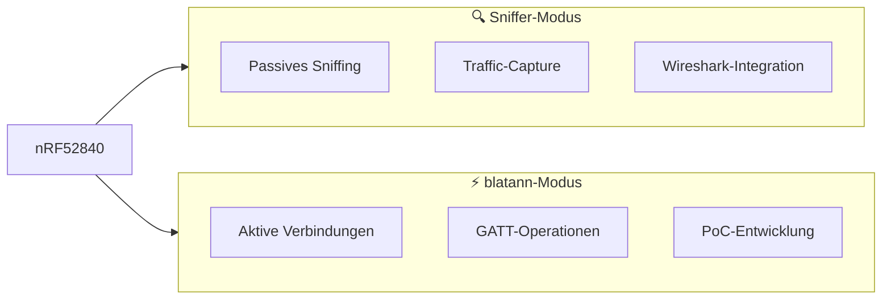

# Hardware-Setup

## nRF52840 USB Dongle

Der nRF52840 USB Dongle ist das **Herzstück** deiner BLE-Sicherheitsanalyse. Mit ~10€ ist er das kostengünstigste professionelle Tool.

### Beschaffung

| Anbieter | Preis | Lieferzeit |
|----------|-------|------------|
| [Mouser](https://www.mouser.de) | ~10€ | 2-3 Tage |
| [DigiKey](https://www.digikey.de) | ~10€ | 2-3 Tage |
| [Nordic Direkt](https://www.nordicsemi.com/Products/Development-hardware/nRF52840-Dongle) | ~10€ | 5-7 Tage |

### Zwei Betriebsmodi



:::warning Wichtig
Du kannst **nicht beide Modi gleichzeitig** verwenden! Je nach Aufgabe musst du die entsprechende Firmware flashen.
:::

### Bootloader-Modus aktivieren

1. **Dongle einstecken** während du den kleinen Reset-Knopf drückst
2. Die rote LED sollte **pulsieren**
3. Ein neues Laufwerk erscheint (wie ein USB-Stick)

```bash
# Prüfen ob Bootloader-Modus aktiv
lsusb | grep Nordic
# Sollte zeigen: Nordic Semiconductor ASA nRF52840
```

## Firmware-Installation

### Für Sniffing (Wireshark)

```bash
# nRF Util installieren
pip install nrfutil

# Sniffer-Plugin
nrfutil install ble-sniffer device

# Seriennummer herausfinden
nrfutil device list

# Firmware flashen
nrfutil ble-sniffer bootstrap --serial-number <SERIAL>
```

### Für blatann (PoC-Entwicklung)

```bash
# pc-ble-driver-py installieren
pip install pc-ble-driver-py

# Firmware finden
python3 -c "import pc_ble_driver_py; print(pc_ble_driver_py.__path__)"
# -> z.B. /home/user/.local/lib/python3.11/site-packages/pc_ble_driver_py

# Firmware flashen (Dongle im Bootloader-Modus)
# Datei: hex/sd_api_v5/connectivity_x.y.z_usb_with_s132_x.y.hex
nrfutil pkg generate --hw-version 52 --sd-req 0x00 \
    --application connectivity_x.y.z_usb_with_s132_x.y.hex \
    --application-version 1 connectivity.zip

nrfutil dfu usb-serial -pkg connectivity.zip -p /dev/ttyACM0
```

## Serielle Schnittstelle

Nach dem Flashen erscheint der Dongle als serielle Schnittstelle:

```bash
# Linux
ls /dev/ttyACM*
# -> /dev/ttyACM0

# Berechtigungen setzen
sudo usermod -a -G dialout $USER
# (Neuanmeldung erforderlich)
```

## Hardware-Kompatibilität

| Hardware | Sniffer | blatann | Bemerkung |
|----------|---------|---------|-----------|
| nRF52840 Dongle | ✅ | ✅ | Empfohlen |
| nRF52840 DK | ✅ | ✅ | Teurer, mehr Features |
| nRF52832 DK | ✅ | ✅ | Älter, weniger RAM |
| Ubertooth One | ⚠️ | ❌ | Nur für Classic BT |

---

:::tip Nächster Schritt
Weiter zur [Software-Installation](./software).
:::
