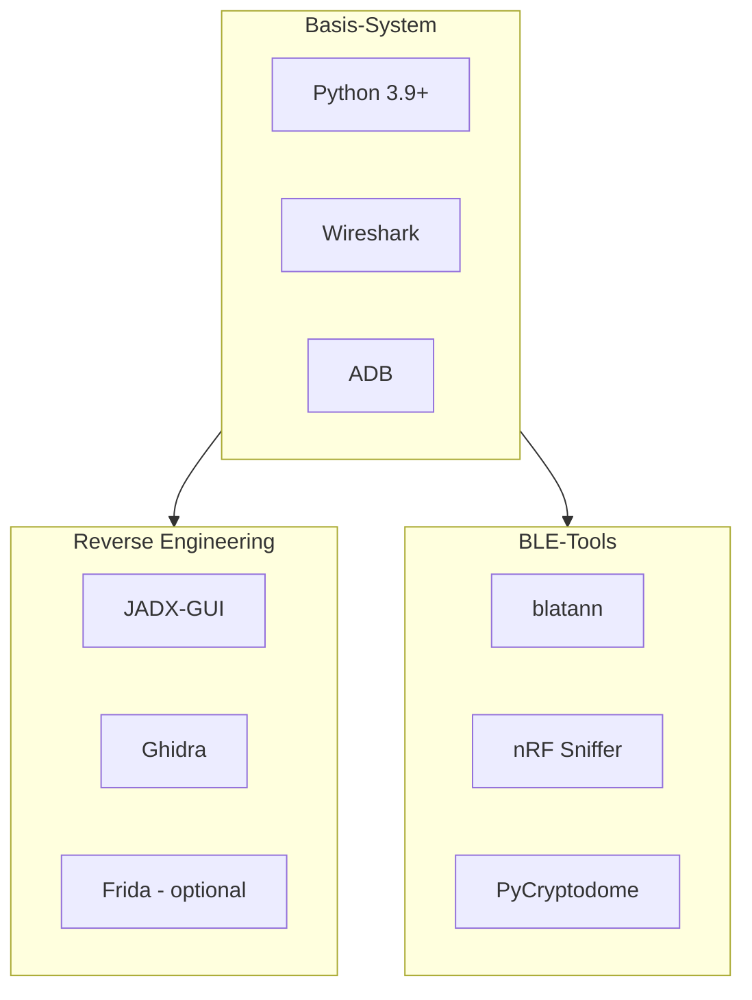

# Software-Installation

## Überblick



## Basis-Installation (Ubuntu/Debian)

```bash
# System aktualisieren
sudo apt update && sudo apt upgrade -y

# Grundlegende Pakete
sudo apt install -y \
    python3 \
    python3-pip \
    python3-venv \
    wireshark \
    tshark \
    adb \
    git \
    curl \
    wget \
    default-jdk \
    build-essential

# Wireshark ohne Root erlauben
sudo dpkg-reconfigure wireshark-common
# -> "Yes" auswählen
sudo usermod -a -G wireshark $USER
```

## Python-Umgebung

```bash
# Virtuelle Umgebung erstellen
python3 -m venv ~/ble-security-env
source ~/ble-security-env/bin/activate

# Kernbibliotheken
pip install --upgrade pip
pip install blatann pycryptodome

# Zusätzliche Tools
pip install pyserial scapy
```

### blatann verifizieren

```python
# test_blatann.py
import blatann
from blatann import BleDevice

print("blatann erfolgreich importiert!")
print(f"BleDevice Klasse: {BleDevice}")
```

## JADX-GUI Installation

```bash
# Download neueste Version
JADX_VERSION="1.5.0"
wget https://github.com/skylot/jadx/releases/download/v${JADX_VERSION}/jadx-${JADX_VERSION}.zip

# Entpacken
unzip jadx-${JADX_VERSION}.zip -d ~/tools/jadx

# Ausführbar machen
chmod +x ~/tools/jadx/bin/jadx-gui

# Alias erstellen
echo 'alias jadx-gui="~/tools/jadx/bin/jadx-gui"' >> ~/.bashrc
source ~/.bashrc
```

### JADX starten

```bash
jadx-gui
# Oder mit APK direkt öffnen
jadx-gui ~/apks/app.apk
```

## Ghidra Installation

```bash
# Download von NSA GitHub
GHIDRA_VERSION="11.2.1"
wget https://github.com/NationalSecurityAgency/ghidra/releases/download/Ghidra_${GHIDRA_VERSION}_build/ghidra_${GHIDRA_VERSION}_PUBLIC_20241105.zip

# Entpacken
unzip ghidra_${GHIDRA_VERSION}_PUBLIC_*.zip -d ~/tools/

# Alias
echo 'alias ghidra="~/tools/ghidra_${GHIDRA_VERSION}_PUBLIC/ghidraRun"' >> ~/.bashrc
source ~/.bashrc
```

## Frida (Optional)

Frida ermöglicht Runtime-Hooking von Android-Apps:

```bash
# Frida Tools
pip install frida-tools

# Frida Server für Android
# (Architektur prüfen: adb shell getprop ro.product.cpu.abi)
FRIDA_VERSION="16.5.9"
wget https://github.com/frida/frida/releases/download/${FRIDA_VERSION}/frida-server-${FRIDA_VERSION}-android-arm64.xz

# Auf Gerät installieren
xz -d frida-server-*.xz
adb push frida-server-* /data/local/tmp/frida-server
adb shell chmod 755 /data/local/tmp/frida-server
adb shell /data/local/tmp/frida-server &
```

## Wireshark BLE-Konfiguration

Nach der nRF Sniffer Installation (siehe [nRF Sniffer Setup](./nrf-sniffer)):

1. **Wireshark öffnen**
2. **Capture → Refresh Interfaces** (F5)
3. **nRF Sniffer for Bluetooth LE** sollte als Interface erscheinen
4. **View → Interface Toolbars → nRF Sniffer for Bluetooth LE** aktivieren

### Nützliche Display-Filter

```
# Alle BLE-Pakete
btle

# Nur ATT-Protokoll (GATT-Operationen)
btatt

# Write Requests
btatt.opcode == 0x12

# Notifications
btatt.opcode == 0x1b

# Bestimmtes Gerät (MAC-Adresse)
btle.advertising_address == aa:bb:cc:dd:ee:ff
```

## Verifikation der Installation

```bash
# Python-Umgebung
python3 --version  # >= 3.9

# blatann
python3 -c "from blatann import BleDevice; print('OK')"

# Wireshark
wireshark --version

# JADX
jadx-gui --version

# Ghidra
ghidra --version 2>/dev/null || echo "Ghidra installiert"

# nRF Sniffer
nrfutil --version
```

---

:::tip Nächster Schritt
Weiter zum [nRF Sniffer Setup](./nrf-sniffer).
:::
