# BLE Fundamentals

Bluetooth Low Energy (BLE) is a wireless communication protocol for energy-efficient IoT devices. This chapter explains the fundamental concepts.

## BLE vs. Bluetooth Classic

| Property | Bluetooth Classic | BLE |
|----------|------------------|-----|
| Introduction | 1999 (v1.0) | 2010 (v4.0) |
| Range | ~100m | ~100m |
| Data Rate | 1-3 Mbps | 125 kbps - 2 Mbps |
| Latency | 100+ ms | 6 ms |
| Power Consumption | High | Ultra-low |
| Application | Audio, Files | Sensors, IoT |

## BLE Stack

### Layers Explained

| Layer | Abbreviation | Function |
|-------|--------------|----------|
| **Physical Layer** | PHY | 2.4 GHz ISM band, GFSK modulation, 40 channels |
| **Link Layer** | LL | Advertising, Scanning, Connection Management, Encryption |
| **L2CAP** | L2CAP | Logical Link Control - Multiplexing, Fragmentation |
| **ATT** | ATT | Attribute Protocol - Client-Server data model |
| **GATT** | GATT | Generic Attribute Profile - Services and Characteristics |
| **GAP** | GAP | Generic Access Profile - Discovery, Connection |
| **SMP** | SMP | Security Manager Protocol - Pairing, Bonding |

## BLE State Machine

### State Descriptions

| State | Description | Typical Role |
|-------|-------------|--------------|
| **Standby** | No radio activity, minimal power | All |
| **Advertising** | Sends periodic advertising packets on channels 37, 38, 39 | Peripheral |
| **Scanning** | Receives advertising packets | Central |
| **Initiating** | Waits for advertising from specific device | Central |
| **Connection** | Active bidirectional data connection | Both |

## Roles in BLE

```mermaid
flowchart LR
    subgraph C["Central"]
        C1["📱 Phone"]
        C2["💻 PC"]
    end
    
    subgraph P["Peripheral"]
        P1["⌚ Watch"]
        P2["🔒 Lock"]
        P3["👓 Glasses"]
    end
    
    C1 <--> P1
    C1 <--> P2
    C2 <--> P3
```

| Role | Function | Examples |
|------|----------|----------|
| **Central** | Initiates connection, controls timing | Smartphone, Computer |
| **Peripheral** | Advertises, provides data | Sensors, Wearables |
| **Broadcaster** | Advertising only, no connection | Beacons |
| **Observer** | Scanning only, no connection | Presence Detection |

## Advertising

Peripherals send **advertising packets** on three advertising channels:

### Advertising Types

| PDU Type | Connectable | Scannable | Use Case |
|----------|-------------|-----------|----------|
| **ADV_IND** | ✓ | ✓ | Standard |
| **ADV_DIRECT_IND** | ✓ | ✗ | Fast Reconnection |
| **ADV_NONCONN_IND** | ✗ | ✗ | Beacons |
| **ADV_SCAN_IND** | ✗ | ✓ | Broadcast with data |

## Security-Relevant Properties

### What BLE Does NOT Do Automatically

:::danger Important
BLE is **not secure by default**!
:::

| Property | Default State | Consequence |
|----------|---------------|-------------|
| Encryption | **Off** | Data readable in plaintext |
| Authentication | **Off** | Anyone can connect |
| Integrity | **Off** (without encryption) | Data can be manipulated |
| Privacy | **Limited** | MAC tracking possible |
| Authorization | **None** | All characteristics open |

### Common Developer Mistakes

| Mistake | Description | Consequence |
|---------|-------------|-------------|
| **Just Works Pairing** | No additional authentication | MITM attacks possible |
| **No Access Controls** | Characteristics without security level | Anyone can read/write |
| **Sensitive Data in Advertising** | Weight, ID, etc. public | Privacy violation |
| **Hardcoded Keys** | Keys in app/firmware | Easy extraction |
| **Weak Encryption** | XOR, Base64, ROT13 | Trivial to break |

---

:::tip Further Reading
- [GATT Architecture](./gatt-architecture) - Understanding data organization
- [Security Modes](./security-modes) - Security mechanisms in detail
:::
