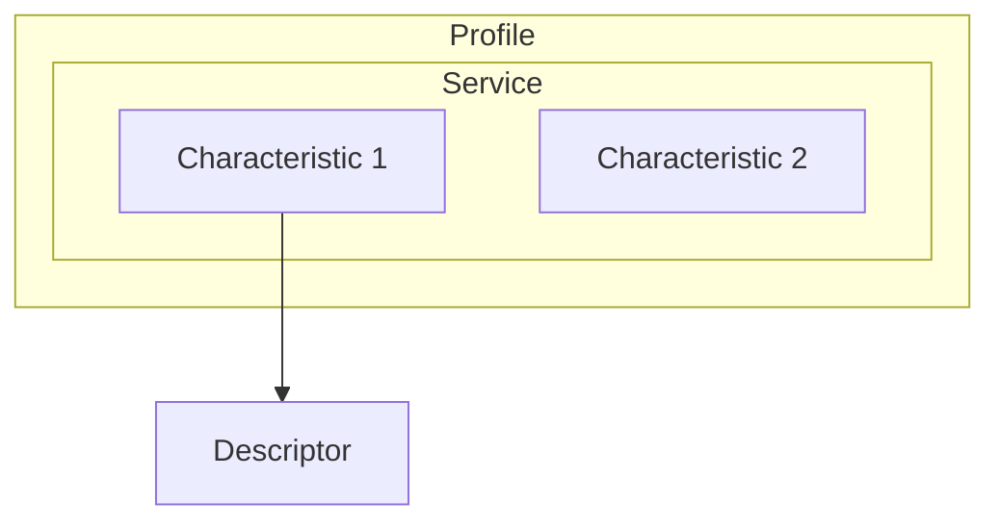

# GATT Architecture

GATT (Generic Attribute Profile) defines how BLE devices organize data.

## Hierarchy

## Levels

| Level | Description |
|-------|-------------|
| Profile | Collection of services |
| Service | Groups related characteristics |
| Characteristic | Single data value |
| Descriptor | Metadata |

## Properties

| Bit | Property | Description |
|-----|----------|-------------|
| 0x02 | Read | Readable |
| 0x04 | Write No Resp | Write without ACK |
| 0x08 | Write | Write with ACK |
| 0x10 | Notify | Server notifications |
| 0x20 | Indicate | Indications with ACK |
