# Welcome to the BLE Security Testing Guide

This guide provides a **systematic approach** for security analysis of Bluetooth Low Energy (BLE) IoT devices.

## What You Will Learn

```mermaid
flowchart LR
    A["📡 Scanning"] --> B["🔍 Analysis"]
    B --> C["📱 App RE"]
    C --> D["💥 PoC"]
    D --> E["📝 Report"]
```



| Phase | Content | Result |
|-------|---------|--------|
| **Phase 1** | Passive Reconnaissance | Device Profile, PCAP |
| **Phase 2** | Active Analysis | GATT Database, Security Matrix |
| **Phase 3** | App Analysis | Protocol, Keys |
| **Phase 4** | Exploitation | Working PoC |
| **Phase 5** | Reporting | Security Report |

## Target Audience

This guide is intended for:

- 🎓 **Students** working on their thesis or research projects
- 🔬 **Security Researchers** analyzing IoT devices
- 👨‍💻 **Developers** wanting to build secure BLE devices
- 🛡️ **Penetration Testers** expanding their skillset to IoT

## Prerequisites

| Requirement | Level |
|-------------|-------|
| Linux/Terminal | Required |
| Python | Required |
| BLE Knowledge | **Not required** (covered here!) |
| Hardware | nRF52840 USB Dongle (~$10) |

## Real-World Examples

This guide is based on **real security research**:

### 🕶️ LED Glasses
- **Finding**: Hardcoded AES-128 key
- **CVSS**: 9.8 (Critical)
- **Impact**: Full device control without app

### 💡 LED Strips  
- **Finding**: XOR "encryption" with hardcoded key
- **CVSS**: 9.8 (Critical)
- **Impact**: Any device controllable

### ⚖️ Smart Scale
- **Finding**: Weight in unencrypted advertising
- **CVSS**: 5.3 (Medium)
- **Impact**: Privacy violation for anyone in 10m range

## Quick Start

```bash
# 1. Hardware: nRF52840 USB Dongle (~$10)

# 2. Install software
pip install blatann pycryptodome

# 3. Start scanning
python3 scanner.py /dev/ttyACM0
```

## Navigation

| Section | Content |
|---------|---------|
| 📘 **Tutorials** | Step-by-step guide |
| 🧠 **Reference** | BLE fundamentals |
| 📂 **Downloads** | Scripts, Templates |

---

:::tip Next Step
Continue with [Prerequisites](./prerequisites).
:::
