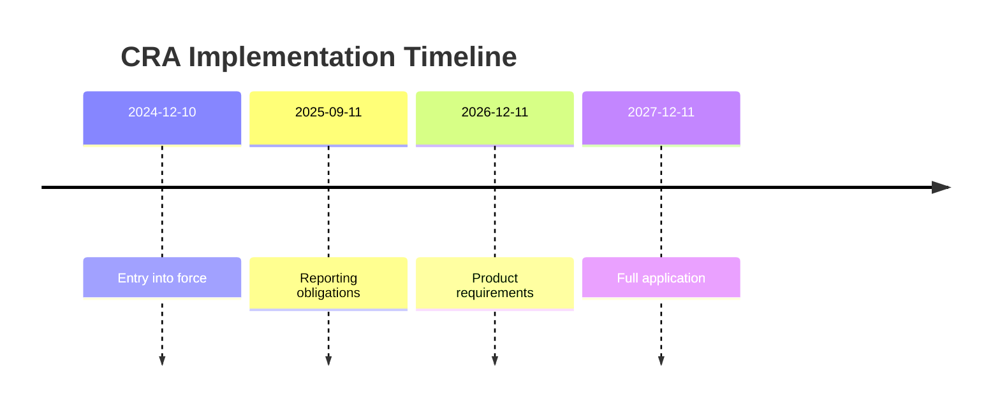
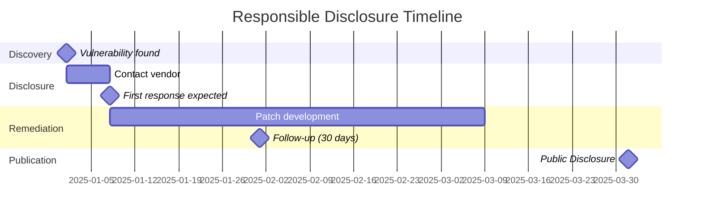

# Legal Framework

:::danger Important
This section provides **orientation** and does not replace legal advice. When in doubt, consult a lawyer specializing in IT law.
:::

## German Criminal Code (StGB)

### §202a - Data Espionage

```
Anyone who unlawfully obtains access to data that is not intended 
for them and is specially protected against unauthorized access, 
by overcoming the access protection, shall be punished with 
imprisonment for up to three years or a fine.
```

**BLE Relevance**:
- **"Specially protected"**: Encryption, Pairing, Authentication
- **"Overcoming"**: Actively bypassing security mechanisms
- Passive sniffing of **unencrypted** advertising packets: **Grey area**
- Intercepting **encrypted** connections with LTK extraction: **Problematic**

### §202b - Interception of Data

```
Anyone who unlawfully intercepts data not intended for them from a 
non-public data transmission using technical means shall be punished 
with imprisonment for up to two years or a fine.
```

### §202c - "Hacker Paragraph"

```
Anyone who prepares an offense under § 202a or § 202b by producing, 
acquiring, selling, or making available passwords, security codes, or 
computer programs whose purpose is the commission of such an offense, 
shall be punished with imprisonment for up to two years or a fine.
```

**BLE Relevance**:
- **Dual-use tools** (Wireshark, nRF Sniffer): Not covered
- **Purpose** and **intent** decisive (BVerfG 2009)
- Security research with legitimate intent: **Permitted**

## Planned Legal Reform (November 2024)

The German Federal Ministry of Justice published a **draft law for modernizing computer criminal law** on November 4, 2024.

### New §202a Para. 3 StGB-E (Safe Harbor)

```
The act is not unlawful if it is performed to identify a 
vulnerability or other security risk of an information technology 
system, and the person intends to inform the responsible party.
```

**Requirements for Safe Harbor**:

1. ✅ **Goal**: Identification of a security vulnerability
2. ✅ **Intent**: Notification to responsible party
3. ✅ **Proportionality**: Necessary technical measures

:::info Status
As of November 2025: The draft law has not yet entered into force. Current legislation remains applicable.
:::

## GDPR Aspects

### Personal Data in BLE

| Data Type | Personal Reference | Example |
|-----------|-------------------|---------|
| MAC Address | Yes (indirect) | Tracking possible |
| Device Name | Possible | "John's iPhone" |
| Health Data | Yes (Art. 9) | Weight, Heart Rate |
| Location | Yes | BLE Beacons |

### Legal Basis for Security Research

```
Art. 6(1)(f) GDPR - Legitimate Interest
├── Interest: IT security research
├── Balancing: Security vs. Privacy
└── Measures: Pseudonymization, Minimization

Art. 89 GDPR / §27 BDSG - Research Exception
├── Scientific research
├── Technical-organizational measures
└── Necessity of processing
```

## EU Cyber Resilience Act (CRA)

**Regulation (EU) 2024/2847** entered into force on December 10, 2024.

### Timeline



### Relevant Articles for Security Researchers

**Recital 80**: 
> Manufacturers should encourage security researchers and not 
> take retaliatory measures.

**Article 13 (Vulnerability Handling)**:
- Manufacturers must establish CVD process
- Report actively exploited vulnerabilities to CSIRT: **24 hours**
- Free security updates: **at least 5 years**

## Best Practices for Legal Security Research

### ✅ Permitted

```
✓ Analysis of own devices
✓ Passive scanning of public advertising packets
✓ Reverse engineering for interoperability
✓ Documentation and publication (after disclosure)
✓ Development of security tools (with legitimate intent)
```

### ⚠️ Grey Area

```
? Sniffing third-party connections (even unencrypted)
? Key extraction from third-party apps
? PoC development for third-party systems
```

### ❌ Prohibited

```
✗ Attacks on third-party devices without permission
✗ Extraction of access credentials
✗ Denial-of-Service attacks
✗ Distribution of exploits without disclosure
```

## Responsible Disclosure

### BSI as Coordinator

The BSI offers a **Coordinated Vulnerability Disclosure (CVD)** process:

📧 **Contact**: vulnerability@bsi.bund.de

### Standard Timeline



### Timeline Variants

| Organization | Standard Deadline | Extension |
|--------------|-------------------|-----------|
| Google Project Zero | 90 days | +14 if actively patching |
| ZDI | 120 days | By agreement |
| CERT/CC | 45 days | By agreement |
| BSI | Flexible | By arrangement |

---

:::warning Summary
1. **Own devices**: Largely permitted
2. **Third-party devices**: Only with permission
3. **Disclosure**: Always responsible!
4. **When in doubt**: Seek legal advice
:::
