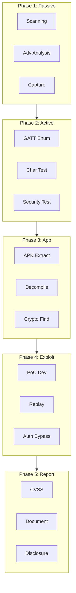

# Test Methodology

A structured methodology is essential for reproducible security analyses.

## The 5-Phase Process

## Phase Overview

| Phase | Duration | Output |
|-------|----------|--------|
| Phase 1 | 2-4h | Device profile, PCAP |
| Phase 2 | 2-3h | GATT database |
| Phase 3 | 4-8h | Protocol, Keys |
| Phase 4 | 3-6h | Working PoC |
| Phase 5 | 2-4h | Security report |

---

:::tip Next Step
Continue with [Hardware Setup](./setup/hardware).
:::
