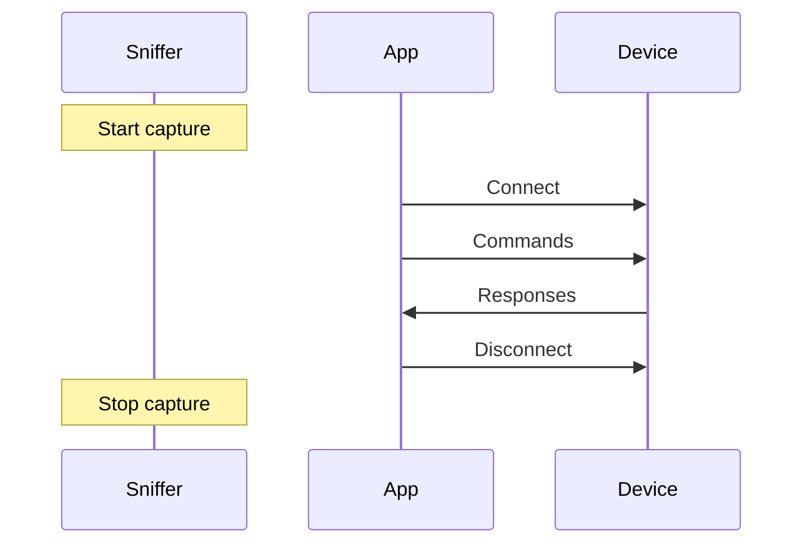

# Wireshark Capture

Capture BLE traffic between app and device.

## Capture Strategy



## Procedure

1. Start Wireshark with nRF Sniffer
2. Configure to follow your target device
3. Start the app
4. Perform all app functions
5. Stop capture and save

## Useful Filters

```
btatt.opcode == 0x12    # Write Request
btatt.opcode == 0x1b    # Notification
btatt.handle == 0x0012  # Specific handle
```

---

:::tip Next Step
Continue with [Phase 2: GATT Enumeration](../phase2/gatt-enumeration).
:::
