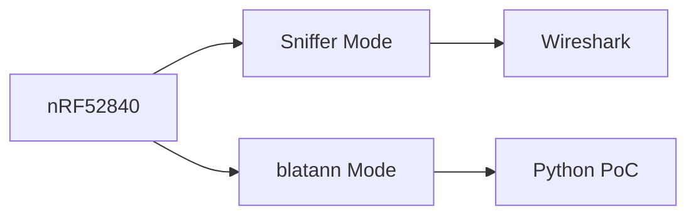

# Hardware Setup

## nRF52840 USB Dongle

The nRF52840 USB Dongle from Nordic Semiconductor is our main tool.

### Purchase Sources

| Vendor | Price | Link |
|--------|-------|------|
| Mouser | ~$10 | mouser.com |
| DigiKey | ~$10 | digikey.com |
| Nordic | ~$10 | nordicsemi.com |

### Two Operating Modes

| Mode | Firmware | Use Case |
|------|----------|----------|
| Sniffer | nRF Sniffer FW | Passive capture |
| blatann | Connectivity FW | Active interaction |

### Bootloader Mode

To flash firmware:
1. Plug in while holding RESET button
2. LED blinks red
3. Drive appears as "JLINK"

---

:::tip Next Step
Continue with [Software Installation](./software).
:::
